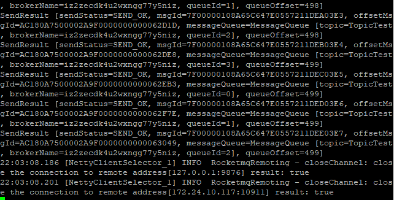
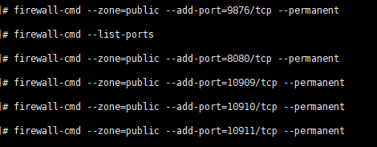

# Rocketmq 安装
[toc]

## 1.配置jdk以及环境maven


## 2. 下载RocketMq

选择4.8.0
```shell
wget https://mirror.bit.edu.cn/apache/rocketmq/4.8.0/rocketmq-all-4.8.0-bin-release.zip
```


## 3. 解压后放到合适位置

```shell
unzip rocketmq-all-4.8.0-bin-release.zip
```


### 创建存放目录
```shell
mkdir /usr/local/mysoftwares/rocketmq -p
```

### 把解压后的RocketMQ移动到指定目录
```shell
mv ./rocketmq-all-4.8.0-bin-release /usr/local/mysoftwares/rocketmq
```

### 切换到对应目录
```shell
cd /usr/local/mysoftwares/rocketmq/rocketmq-all-4.8.0-bin-release/bin
```

## 4. 修改启动配置文件
RocketMq 的 broker 以及 server 都是默认使用4个G的内存，需要将它改小


```shell
vi runbroker.sh
vi runserver.sh
```

* 参考设置：
> JAVA_OPT="${JAVA_OPT} -server -Xms256m -Xmx256m -Xmn128m -XX:MetaspaceSize=128m -XX:MaxMetaspaceSize=320m"


注： 修改nameserver和broker 默认指定的是内网IP，我们需要指定IP为外网ip(尤其是把rocket搭载远程服务器的)。如果不该，后面用java代码连接远程rocketMQ的时候会报错，进坑。

```shell
vim ../conf/broker.conf
```

添加如下内容


## 5.修改环境变量

为了后面java 远程连接的测试，需要配置以下
```shell
vim /etc/profile
```
在文件尾部添加以下内容。
```shell
export NAMESRV_ADDR=localhost:9876
```

重新加载环境变量
```shell
source /etc/profile
```


## 6.启动服务
需要启动的有namesrv 和 broker
进入 bin 目录：
```shell
cd /usr/local/mysoftwares/rocketmq/rocketmq-all-4.8.0-bin-release/bin
```

启动name server
```shell
nohup sh mqnamesrv &
```


启动 broker
```shell
nohup sh mqbroker -n localhost:9876 &
```
上面的命令不会自动创建topic，推荐用下面的
```shell
nohup sh mqbroker -n localhost:9876 autoCreateTopicEnable=true &
```

同样，启动topic 不会使用公网的时候，
```shell
nohup sh mqbroker -n localhost:9876 -c ../conf/broker.conf &
```


备注：
&：是后台方式进行启动进程
nohup：父进程关闭会导致子进程也关闭。nohup是让当前的启动的进程的父进程为根进程，而不是让当前所在的终端成为为其父进程。添加nohup后。即使当前终端关闭了，此nohup修饰启动的进程不会随着被关闭。
-n：用于broker指定name server的地址
-c：指定配置文件


## 7.结束服务

关闭
```shell
sh mqshutdown namesrv

sh mqshutdown broker
```


## 测试
打开新的两个终端
生产者生产消息：
```shell
sh tools.sh org.apache.rocketmq.example.quickstart.Producer
```



消费者消费消息：

```shell
sh tools.sh org.apache.rocketmq.example.quickstart.Consumer
```


注： 第五步的修改变量 
export NAMESRV_ADDR=localhost:9876 
目的就是为了告诉生产者和消费者 name server 的地址。


## 8. 安装RocketMQ监控平台

RocketMQ提供一个监控RocketMQ的后台管理界面。
在这里下载：https://github.com/apache/rocketmq-externals

找到 rocketmq-console模块下，编辑application.properties文件


保存后，打开cmd，利用maven 命令打包
```shell
mvn clean package -Dmaven.test.skip=true
```

可以看到在target目录下生成了jar包


把生成的jar包上传到RocketMQ所在的服务器上
然后启动该jar包

启动方式一，前台启动模式
```java
java -jar  rocketmq-console-ng-2.0.0.jar
```
启动方式二，后台无日志模式
```shell
nohup java -jar rocketmq-console-ng-2.0.0.jar &>/dev/null &
```


然后访问公网ip:


**注意**：
1.
RocketMQ的几个端口：



2.
阿里云服务器能够访问是需要给防火墙添加8080端口的，否则依旧无法访问


参考博客：
https://blog.csdn.net/jianghuchuang/article/details/113822953