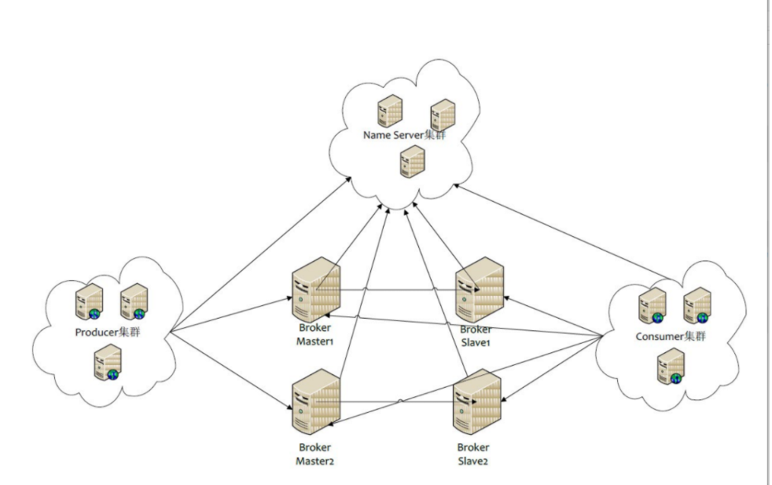
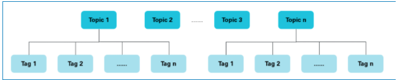

# RocketMQ

## 1.RocketMQ角色

## 2.集群特点

* Name Server是一个几乎无状态结点，可集群部署，结点之间无任何信息同步

* Broker 部署相对复杂，Broker 分为Master 与Slave，一个Master 可以对应多个Slave，但是一个Slave 只能对应一个Master，Master与Slave的对应关系通过指定相同的BrokerName， 不同的BrokerId来定义，BrokerID为0 表示Master，非0表示Slave。 Master 也可以部署多个。 每个Broker 与NameServer 集群中的所有节点建立长连接，定时注册Topic信息到所有NameServer。
* Producer 与 NameServer 集群中的其中一个节点（随机选择）建立长连接，定期从NameSer 取Topic 路由信息，并向提供Topic 服务的Master建立长连接，且定时向Master发送心跳。Producer 完全无状态，可集群部署。
* Consumer与NameServer 集群中其中一个节点（随机选择）长连接，定期从NameServer取Topic路由信息，并向提供Topic 服务的Master，Slave建立长连接，且定时向Master，Slave发送心跳。Consumer 即可以从Master 订阅消息，也可以从Slave 订阅消息，订阅规则由roker配置决定。

## 3.集群模式

### 3.1 单Master 模式
这种方法风险较大，一旦Broker 重启或者宕机时，会导致整个服务不可用。不建议线上环境使用，可以用于本地测试

### 3.2 多Master模式
一个集群无Slave，全是Master
* 优点：配置简单，单个Master 宕机或重启维护对应用无影响，在磁盘配置为RAID10时，即使服务器宕机不可恢复的情况下，由于RAID10磁盘非常可靠，消息也不会丢（异步刷盘丢失少量消息，同步刷盘一条不丢），性能最高
* 缺点：单台机器宕机期间，这台机器未被消费的消息在机器恢复之前不可订阅，消息实时性会收到影响。

### 3.3 多Master多Slave模式（异步）
每个Master 配置一个Slave ，有多对Master-Slave，HA采用异步复制方式，主备有短暂消息延迟（毫秒级），这种模式的优缺点如下：

* 优点：即使磁盘损坏，消息丢失的非常少，且消息实时性不会受影响，同时Master 宕机后，消费者仍然可以从Slave 消费，而且此过程对应用透明，不需要人工干预，性能同多Master 模式几乎一样
* 缺点： Master 宕机，磁盘损坏情况下会丢失少量消息。

### 3.4 多Master多Slave模式（同步）

每个Master 配置一个Slave，有多对Master-Slave，HA 采用同步双写方式，即只有主备都写成功，才向应用返回成功，这种模式的优缺点如下
* 优点：数据与服务都无单点故障，Master 宕机情况下，消息无延迟，服务可用性与数据可用性都非常高
* 缺点： 性能比异步复制模式略低（大约低10%左右），发送单个消息的RT会略高，且目前版本在主节点宕机后，备机不能自动切换为主机。

## topic 和 tag
### 背景信息
topic 
消息主题，通过topic 对不同的业务消息进行分类。

tag
消息标签，用来进一步区分某个topic下的消息分类，消息从生产者发出即带上的属性

topic和tag的关系如下图所示。

### 适用场景
那么什么时候用topic，什么时候该用tag？
从以下几个方面进行判断：
* **消息类型**是否一致：如普通消息，事务消息，定时消息，顺序消息，不同的消息类型使用不同的topic，无法通过tag进行进行区分。
* **业务**是否相关联：没有直接关联的消息，如淘宝交易消息，京东物流消息使用不同的Topic进行区分；而同样是天猫交易消息，电器类订单，女装类订单，化妆品类订单的消息可以用tag进行区别。
* **消息优先级**是否一致：如同样是物流消息，盒马必须小时内送达，天猫超市24小时内送达，淘宝物流则相对会慢一些，不同优先级的消息用不同的topic进行区分。
* **消息量级**是否相当：有些业务消息虽然量小但是实时性要求高，如果跟某些万亿量级的消息使用同一个Topic，则有可能回因为过长的等待时间而“饿死”，此时需要将不同量级的消息进行拆分，使用不同的topic

### 场景示例
以天猫交易平台为例，订单消息和支付消息属于不同业务类型的消息，分别创建Topic_Order和Topic_Pay，其中订单消息根据商品品类以不同的Tag再进行细分，例如电器类，男装类，女装类，化妆品类等被各个不同的系统所接收。

