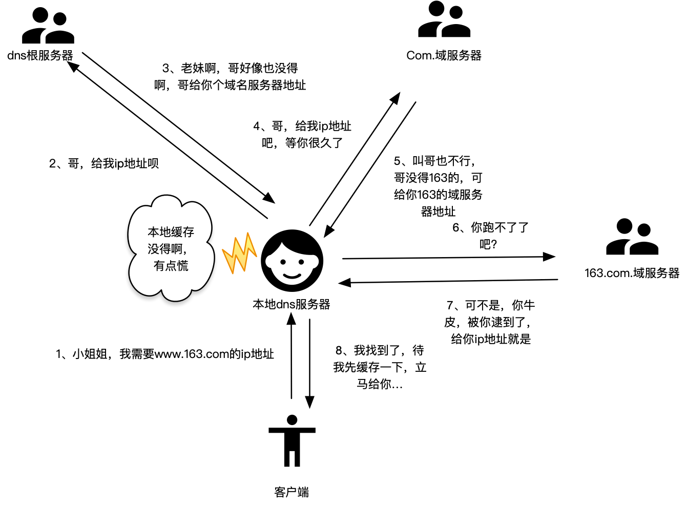

# DNS

[TOC]

## DNS是什么
**官方解释**： DNS(Domain Name System,域名系统)，因特网作为**域名和IP地址相互映射**的一个**分布式数据库**，能够使用户更方便的访问互联网，而不用去记住能够被机器直接读取的IP数串。通过主机名，最终得到该主机名对应的IP地址的过程叫做域名解析（或主机名解析）。

**通俗的讲**，我们更习惯于记住一个网站的名字，比如www.baidu.com，二不是记住它的ip地址，比如：167.23.10.2.

## 谈谈DNS解析过程
  

* 请求一旦发起，若是chrome浏览器，先在浏览器找之前**有没有缓存过的域名所对应的ip地址**，有的话，直接跳过dns解析，若是没有，就会**找硬盘的hosts文件**，有的话，直接找到hosts文件里面的ip

==字节问了修改hosts，浏览器会变吗？==
* 如果本地的hosts文件没有能的到对应的ip地址，浏览器会发出一个**dns请求到本地dns服务器，本地dns服务器一般都是你的网络介入服务商提供**，比如中国电信，中国移动等。
* 查询你输入的网址的DNS请求到达本地DNS服务器之后，**本地DNS服务器会首先查询它的缓存记录**，如果缓存中有此条记录，就可以直接返回结果，此过程是**递归的方式进行查询**。如果没有，本地DNS服务器还要向**DNS根服务器**进行查询。
* 本地DNS服务器继续向域服务器发出请求，在这个例子中，请求的对象是.com域服务器。.com域服务器收到请求之后，也不会直接返回域名和IP地址的对应关系，而是告诉本地DNS服务器，你的域名的解析服务器的地址。
* 最后，本地DNS服务器向**域名的解析服务器**发出请求，这时就能收到一个域名和IP地址对应关系，本地DNS服务器不仅要把IP地址返回给用户电脑，还要把这个对应关系保存在缓存中，以备下次别的用户查询时，可以直接返回结果，加快网络访问。

## DNS查询方式

### 递归解析
当局部DNS服务器自己不能回答客户机的DNS查询时，它就需要向其他DNS服务器进行查询。此时有两种方式。**局部DNS服务器自己负责向其他DNS服务器进行查询，一般是先该域名的根域服务器查询，再由根域名服务器一级级向下查询**。最后得到的查询返回给局部DNS服务器，再由局部DNS服务器返回给客户端。

### 迭代解析
当局部DNS服务器自己不能回答客户机的DNS查询时，也可以通过迭代查询的方式进行解析。局部DNS服务器不是自己向其他DNS服务器进行查询，**而是把能解析该域名的其他DNS服务器的IP地址返回给客户端DNS程序**，客户端DNS程序再继续向这些DNS服务器进行查询，直到得到查询结果为止。也就是说，迭代解析只是帮你找到相关的服务器而已，而不会帮你去查。比如说：baidu.com的服务器ip地址在192.168.4.5这里，你自己去查吧，本人比较忙，只能帮你到这里了。

## DNS负载均衡

  当一个网站有足够多的用户的时候，假如每次请求的资源都位于同一台机器上面，那么这台机器随时可能会蹦掉。处理办法就是用DNS负载均衡技术，它的原理是在DNS服务器中 ==为同一个主机名配置多个IP地址,在应答DNS查询时,DNS服务器对每个查询将以DNS文件中主机记录的IP地址按顺序返回不同的解析结果,将客户端的访问引导到不同的机器上去,使得不同的客户端访问不同的服务器,== 从而达到负载均衡的目的｡例如可以根据每台机器的负载量，该机器离用户地理位置的距离等等。

## 为什么域名解析用UDP协议？
  因为UDP快啊！UDP的DNS协议只要一个请求、一个应答就好了。而使用基于TCP的DNS协议要三次握手、发送数据以及应答、四次挥手。但是UDP协议传输内容不能超过512字节。不过客户端向DNS服务器查询域名，一般返回的内容都不超过512字节，用UDP传输即可。

## 为什么区域传送用TCP协议？
  因为TCP协议可靠性好啊！你要从主DNS上复制内容啊，你用不可靠的UDP？ 因为TCP协议传输的内容大啊，你用最大只能传512字节的UDP协议？万一同步的数据大于512字节，你怎么办？