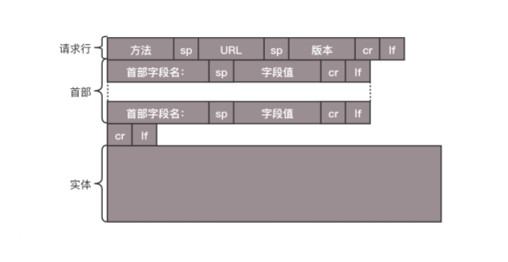
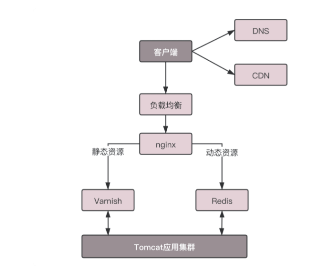
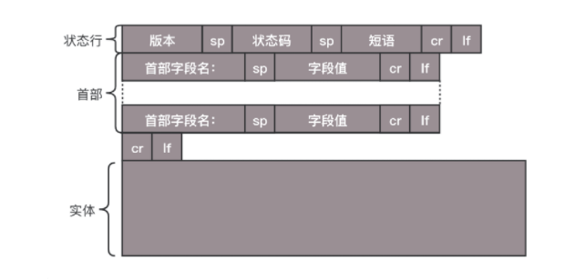
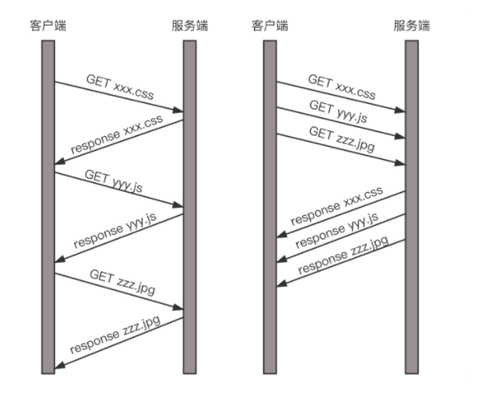
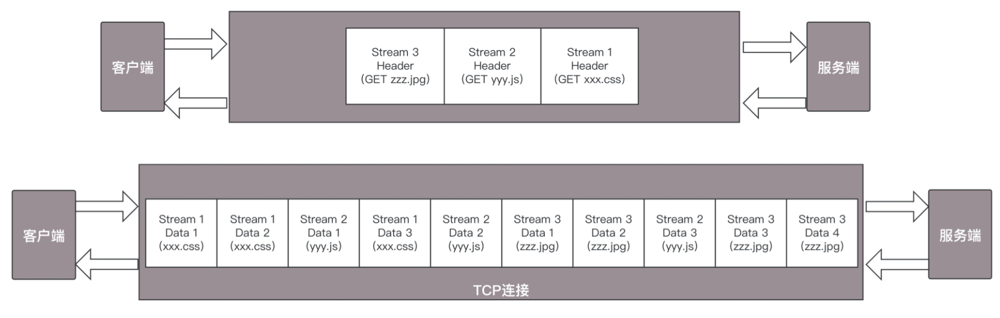

[toc]

# HTTP 协议

如果要登录网站： http://www.163.com
http://www.163.com 是URL， 叫做统一资源定位符。之所以叫做统一，是因为它是有格式的。HTTP 称为 协议， www.163.com 是一个域名， 表示互联网上的一个位置。 有的URL会有更详细的位置表示。 当把字符串输入到浏览器的筐里的时候，浏览器才知道如何进行统一处理。

## HTTP请求的准备

浏览器将www.163.com 这个域名发送给DNS服务器，让它解析为IP地址。有关DNS的过程，可以看DNS的介绍。

解析为IP地址后， 建立TCP连接。（三次握手）

## HTTP请求的构建

建立了连接之后，浏览器就要发送HTTP的请求。

请求格式如下：

HTTP 的报文 大概分为三部分。第一部分是 请求行，第二部分是请求的首部，第三部分是请求的正文实体。

### 第一部分：请求行

在请求行中， URL就是 http：//www.163.com ，版本为HTTP 1.1。

重点是方法。方法有几种类型。

对于访问网页来讲，最常用的类型就是GET。 故名思义，GET 就是去服务器获取一些资源。对于访问网页来讲，要获取的资源往往是一个页面。其实也有很多其他的格式，比如说返回一个JSON 字符串，到底要返回什么，是由服务器端的实现决定的。

另外一种类型叫做 POST。它需要主动告诉服务端一些信息，而非获取。要告诉服务端什么呢？一般会放在正文里面。正文可以有各种各样的格式。常见的格式也是 JSON。

还有一种类型叫PUT，就是向指定资源位置上传最新内容。但是，HTTP的服务器往往是不允许上传文件的，所以PUT和POST 就都变成了要传给服务器东西的方法。

在实际使用过程中，这两者还会有稍许的区别。 POST往往是用来创建一个资源的，而PUT 往往是用来修改一个资源的。

再有一种常见的就是 DELETE。这个顾名思义就是用来删除资源的。例如，我们要删除一个云主机，就会调用 DELETE 方法。

### 第二部分：首部字段

请求行下面就是我们的首部字段。首部是 key value，通过冒号分隔。这里面，往往保存了一些非常重要的字段。

例如，**Accept-Charset**，表示客户端可以接受的字符集。防止传过来的是另外的字符集，从而导致出现乱码。

再如，**Content-Type** 是指正文的格式。例如，我们进行 POST 的请求，如果正文是 JSON，那么我们就应该将这个值设置为 JSON。

要重点说一下的就是**缓存**。为啥要使用缓存呢？那是因为一个非常大的页面有很多东西。

例如，我浏览一个商品的详情，里面有这个商品的价格、库存、展示图片、使用手册等等。商品的展示图片会保持较长时间不变，而库存会根据用户购买的情况经常改变。如果图片非常大，而库存数非常小，如果我们每次要更新数据的时候都要刷新整个页面，对于服务器的压力就会很大。

对于这种高并发场景下的系统，在真正的业务逻辑之前，都需要有个接入层，将这些静态资源的请求拦在最外面。

Nginx对于静态资源，有Varnish缓存区。 当缓存过期的时候，才会访问真正的Tomcat 应用集群。

在HTTP头里面，**Cache-control** 是用来控制缓存的。当客户端发送的请求中包含max-age 指令时，如果判定缓存层中，资源的缓存时间数值比指定时间的数值少，那么客户端可以接收缓存的资源，当指定的max-age值为0， 缓存层通常要将请求转发给应用层。

**If-Modified-Since** 也是一个关于缓存的。也就是说，如果服务器的资源在某个时间之后更新了，那么客户端就应该下载最新的资源；如果没有更新，服务端会返回“304 Not Modified”的响应，那客户端就不用下载了，也会节省带宽

### HTTP请求的发送
HTTP 协议是基于TCP协议的，所以使用面向连接的方式发送请求，通过sream 二进制的方式传给对象。 当然，到了TCP层，他会把二进制流编程一个个报文段发送给服务器。

在发送给每个报文段的时候，都需要对方有一个回应 **ACK**，来保证报文可靠地到达了对方。如果没有回应，那么 TCP 这一层会进行重新传输，直到可以到达。同一个包有可能被传了好多次，但是 HTTP 这一层不需要知道这一点，因为是 TCP 这一层在埋头苦干。

TCP 层发送每一个报文的时候，都需要加上自己的地址（即源地址）和它想要去的地方（即目标地址），将这两个信息放到 IP 头里面，交给 IP 层进行传输。

IP 层需要查看目标地址和自己是否是在同一个局域网。如果是，就发送 ARP 协议来请求这个目标地址对应的 MAC 地址，然后将源 MAC 和目标 MAC 放入 MAC 头，发送出去即可；如果不在同一个局域网，就需要发送到网关，还要需要发送 ARP 协议，来获取网关的 MAC 地址，然后将源 MAC 和网关 MAC 放入 MAC 头，发送出去。

网关收到包发现 MAC 符合，取出目标 IP 地址，根据路由协议找到下一跳的路由器，获取下一跳路由器的 MAC 地址，将包发给下一跳路由器。

这样路由器一跳一跳终于到达目标的局域网。这个时候，最后一跳的路由器能够发现，目标地址就在自己的某一个出口的局域网上。于是，在这个局域网上发送 ARP，获得这个目标地址的 MAC 地址，将包发出去。

目标的机器发现 MAC 地址符合，就将包收起来；发现 IP 地址符合，根据 IP 头中协议项，知道自己上一层是 TCP 协议，于是解析 TCP 的头，里面有序列号，需要看一看这个序列包是不是我要的，如果是就放入缓存中然后返回一个 ACK，如果不是就丢弃。

TCP 头里面还有端口号，HTTP 的服务器正在监听这个端口号。于是，目标机器自然知道是 HTTP 服务器这个进程想要这个包，于是将包发给 HTTP 服务器。HTTP 服务器的进程看到，原来这个请求是要访问一个网页，于是就把这个网页发给客户端。

### HTTP返回的构建
HTTP 的返回报文也是有一定格式的。这也是基于 HTTP 1.1 的。

状态码会反映HTTP请求的结果。“200”意味着大吉大利；而我们最不想见的，就是“404”，也就是 “服务端不乏相应这个请求”。然后，短语会大概说一下原因。

接下来就是返回首部的 key value。

这里的， Retry-After 表示，告诉客户端应该在多长时间以后再次尝试以下。“503错误”是指服务器暂时不再和这个值配合使用”

在返回的头部里面也会有**Content-Type** ，表示返回的时**HTML**， 还是**JSON**。

构造好了返回的HTTP报文，接下来就是把这个报文发送出去。还是交给 Socket 去发送，还是交给 TCP 层，让 TCP 层将返回的 HTML，也分成一个个小的段，并且保证每个段都可靠到达。

这些段加上 TCP 头后会交给 IP 层，然后把刚才的发送过程反向走一遍。虽然两次不一定走相同的路径，但是逻辑过程是一样的，一直到达客户端。

客户端发现 MAC 地址符合、IP 地址符合，于是就会交给 TCP 层。根据序列号看是不是自己要的报文段，如果是，则会根据 TCP 头中的端口号，发给相应的进程。这个进程就是浏览器，浏览器作为客户端也在监听某个端口。

当浏览器拿到了 HTTP 的报文。发现返回“200”，一切正常，于是就从正文中将 HTML 拿出来。HTML 是一个标准的网页格式。浏览器只要根据这个格式，展示出一个绚丽多彩的网页。

这就是一个正常的 HTTP 请求和返回的完整过程。

## HTTP2.0

HTTP协议也在不断的进化过程中，在HTTP 1.1基础上便有了HTTP 2.0

HTTP 1.1在应用层以纯文本的形式进行通信。每次通信都要带完整的HTTP的头， 而且不考虑pipeline模式的化，每次的过程总是像上面描述的那样一去一回。这样在实时性，并发性上都有问题。

为了解决这些问题，HTTP 2.0 会对 HTTP 的头进行一定的压缩，将原来每次都要携带的大量 key value 在两端建立一个索引表，对相同的头只发送索引表中的索引。

另外，HTTP 2.0 协议将一个 TCP 的连接中，切分成多个流，每个流都有自己的 ID，而且流可以是客户端发往服务端，也可以是服务端发往客户端。它其实只是一个虚拟的通道。流是有优先级的。

HTTP 2.0 还将所有的传输信息分割为更小的消息和帧，并对它们采用二进制格式编码。常见的帧有 **Header** 帧，用于传输 Header 内容，并且会开启一个新的流。再就是 **Data 帧**，用来传输正文实体。多个 Data 帧属于同一个流。

通过这两种机制，**HTTP 2.0** 的客户端可以将多个请求分到不同的流中，然后将请求内容拆成帧，进行二进制传输。这些帧可以打散乱序发送， 然后根据每个帧首部的流标识符重新组装，并且可以根据优先级，决定优先处理哪个流的数据。

假设我们的一个页面要发送三个独立的请求，一个获取 **css**，一个获取**js**，一个获取图片 jpg。如果使用 HTTP 1.1 就是串行的，但是如果使用 HTTP 2.0，就可以在一个连接里，客户端和服务端都可以同时发送多个请求或回应，而且不用按照顺序一对一对应。

HTTP 2.0 其实是将三个请求变成三个流，将数据分成帧，乱序发送到一个 TCP 连接中。

* HTTP 协议虽然很常用，也很复杂，重点记住 GET、POST、PUT、DELETE 这几个方法，以及重要的首部字段；

* HTTP 2.0 通过头压缩、分帧、二进制编码、多路复用等技术提升性能；