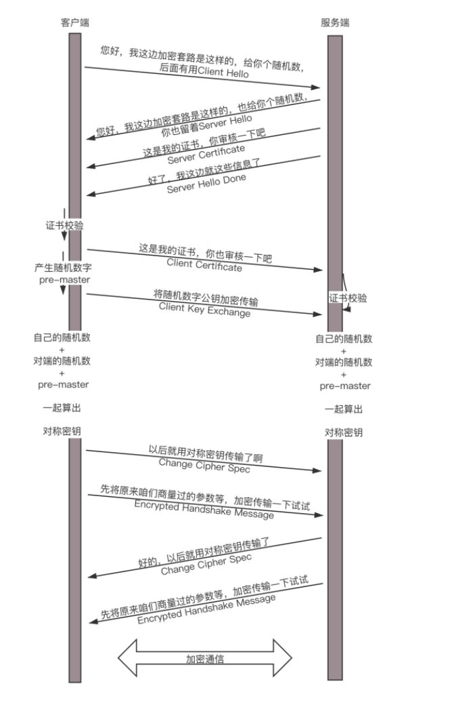

# HTTPS协议

## HTTP可能出现的问题？

用HTTP协议，看新闻还没有问题， 但是换到更加严肃的场景中，就存在很多的安全风险。例如，下单做一次支付，如果 还是使用的普通HTTP协议，那么很容易 会被黑客盯上。

发送一个请求，说我要点个外卖，但是这个网络包被截获了，于是在服务器回复你之前，黑客假装自己就是外卖网站，然后给你回复一个假的消息说：“好啊好啊，来来来，银行卡号，密码拿来。”这时候把银行卡密码发给它，就真的上套了。

要解决这个问题，一般的思路就是**加密**。加密分为两种方式一种是**对称加密**，一种是**非对称加密**。

在对称加密算法中，加密和解密使用的密钥是相同的。加密和解密使用的是同一个密钥。因此，对称加密算法要保证安全性的话，密钥要做好保密。只能让使用的人直到，不能对外公开。

在非对称加密算法中，加密使用的密钥和解密使用的密钥是不相同的。一把是作为公开的密钥，另一把是作为谁都不能给的私钥。公钥加密的信息，只有私钥才能解密。私钥加密的信息，只有公钥才能解密。

因为对称加密算法相比非对称加密算法来说，效率要高的多，性能也好，所以交互的场景下多用对称加密。

### http 存在的问题
* 容易被监听
  * http通信都是明文，数据在客户端与服务器通信过程中，任何一点都可能被劫持。例如发送了银行卡号和密码，hacker截取到数据，就能看到卡号和密码，这时很危险的
* 被伪装
  * http通信时，无法保证通行双方是合法的，通信方可能是伪装的。比如你请求www.taobao.com,你怎么直到返回的数据是淘宝，中间人可能返回数据伪装成淘宝。
* 被篡改
  * hacker中间篡改数据后，接收方并不知道数据已经被更改

## 对称加密
假设你和外卖网站约定了一个密钥，你发送请求的时候用这个密钥进行加密，外卖网站用同样的密钥进行解密。这样就算中间的黑客截获了你的请求，但是它没有密钥，还是破解不了。

这中间存在一个问题，即 如何约定这个密钥？如果密钥在互联网上传输，很有可能让黑客截获的。黑客一旦截获这个密钥，它可以佯作不知，静静地等着你们两个交互。这时候你们之间互通的任何消息，它都能截获并且查看，就等你把银行卡账号和密码发出来。

就如同谍战剧中看到这样的场景，特工破译的密码有个密码本。截获无线电台，通过密码本就能将原文破解出来。怎么把密码本给对方呢？只能通过线下传输。

比如，和外卖网站偷偷约定时间地点。它给你一个纸条，上面写着你们两个的密钥，然后说以后就用这个密钥在互联网上订外卖了。 你们接头的时候，也会先约定一个口号，什么“天王盖地虎”之类的，口号对上了，才能把纸条给它。但是，“天王盖地虎”同样也是对称加密密钥，同样存在如何把“天王盖地虎”约定成口号的问题。而且在谍战剧中一对一接头可以，但在互联网中，客户太多，不能实现。

* 优点： 运算速度快
* 缺点： 无法安全地将密钥传输给通信方

## 非对称加密
因此，只要是对称加密，就会永远在这个死循环里出不来，这个时候，就需要非对称加密介入进来。

非对称加密的私钥放在外卖网站这里，不会再互联网上传输，这样就能保证这个密钥的私密性。但是，对应私钥的公钥，是可以再互联网上随意传播的，只要外卖网站把这个公钥给你，你们就可以愉快地互通了。

比如说你用公钥加密，说“我要定外卖”，黑客就算中间截获了这个报文，因为它没有私钥也是解不开的，所以这个报文可以顺利到达外卖网站，外卖网站用私钥把这个报文解出来，然后回复，“那给我银行卡和支付密码吧”。

这里存在问题，回复的这句话，是外卖网站拿公钥加密的，互联网上人人都可以把它打开，包括黑客。那外卖网站可以拿私钥加密吗？当然不能，因为它自己的私钥只有它自己知道，谁也解不开

另外，这个过程还有一个问题，黑客也可以模仿发送“我要定外卖”这个过程的，因为它也有外卖网站的公钥。

为了解决这个问题，一对公钥私钥是不够的，客户端同时也需要自己的公钥和私钥，并且客户端要把自己的公钥，给外卖网站。

这样，客户端给外卖网站发送的时候，用外卖网站的公钥加密，然后外卖网站给客户端发送消息的时候，使用客户端的公钥。这样就算有黑客企图模拟客户端获取一些信息，或者半路截获回复信息，但是由于它没有私钥，这些信息它还是打不开。

### 数字证书
不对称加密也会有同样的问题，如何将不对称加密的公钥给对方呢？一种是放在一个公网的地址上，让对方下载；另一种就是建立连接的时候，传给对方。

这两种方法有相同的问题，那就是，如何 鉴别别人给你的公钥是对的。 会不会有人冒充外卖网站，发给你一个它的公钥。接下来，你和它所有的互通，看起来都是没有任何问题的。毕竟每个人都可以创建自己的公钥和私钥。

例如， 搭建了一个网站，可以创建私钥，

然后需要根据私钥，创建公钥。这个时候就需要权威部门的接入了，就像每个人可以打印自己的简历，说自己是谁，但是有公安局盖章的，就只有户口本，这个才能证明你是你。这个由权威部门颁发的称为**证书（Certificate）**

**证书**里面有什么呢？有**公钥**，这时最重要的，还有证书的**所有者**，就像户口本上有你的姓名和身份证号，说明这个户口本是你的；另外还有证书的**发布机构**和证书的**有效性**，这个有点像身份证上的机构是哪个区公安局，有效期到多少年。

这个证书怎么生成的呢？ 会不会有人假冒权威机构颁发证书呢？就像假身份证，假户口本一样。生成证书需要发起一个证书请求，需要把请求发送给一个权威机构去认证，这个权威机构称之为**CA**(Certificate Authority)。

将证书请求发送给权威机构，权威机构会给这个证书卡一个章，称之为签名算法。 那么如何保证签名是真的权威机构签名呢？ 用权威机构的**私钥**

签名算法大概是这样工作的：一般是对信息做一个hash计算，得到一个hash值，这个过程是不可逆的，无法通过Hash 值得出原来的信息内容。在把信息发送出去时，把这个Hash 值加密（私钥）后，作为一个签名和信息一起发出去。

这样一来，以后不会从网站上得到公钥，而是得到一个**证书**，这个证书有发布机构CA，只要得到这个发布机构CA的公钥，去解密证书的签名，如果解密成功了，Hash也对的上，就说明这个外卖网站的公钥没有啥问题。

PS: 要验证证书，需要CA的公钥，CA的公钥需要更牛的CA给它签名，然后形成CA的证书，这样层层上去，直到全球皆知的几个著名大CA，称为root CA，做最后的背书。通过这种层层授信背书的方式，从而保证了非对称加密模式的正常运转。

* 优点：可以更安全地将公开密钥传输给通信发送方
* 缺点：运算速度慢

## HTTPS是什么
HTTPS并不是新协议，而是让HTTP 先和SSL(Serure Sockets Layer)通信，再由SSL 和 TCP 通信， 也就是说HTTPS 使用了隧道进行通信。通过使用SSL,HTTPS具有了加密（防窃听），认证（防伪装）和完整性保护（防篡改）。

### SSL
SSL 的原理就是HTTPS 与HTTP不同的地方

## HTTPS的工作模式

非对称加密在性能上不如对称加密，那是否能将两者结合起来呢？例如，公钥私钥主要用于传输对称加密地私钥，而真正的双方大数据量的通信通过对称加密进行的。

这就是HTTPS 协议的总体思路。

* Client 给出协议版本号，一个客户端生成的随机数，以及客户端支持的加密方法
* Server 确认双方使用的加密方法，并给出数字证书，以及一个服务器生成的随机数(Server random)
* Client确认数字证书有效，然后生成一个新的随机数，并使用数字证书的公钥，加密这个随机数，发给Server。
* Server使用自己的私钥，获取Client发来的随机数
* Client和Server根据约定的加密方法，使用前面三个随机数，生成“对话密钥（session key）”,用来加密接下来的整个对话过程。

