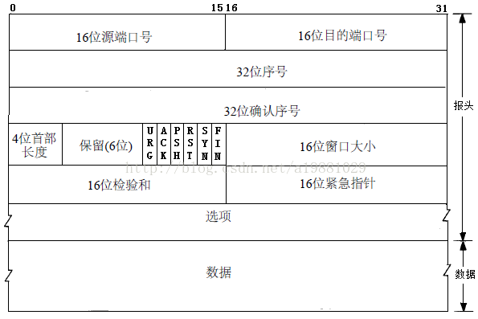
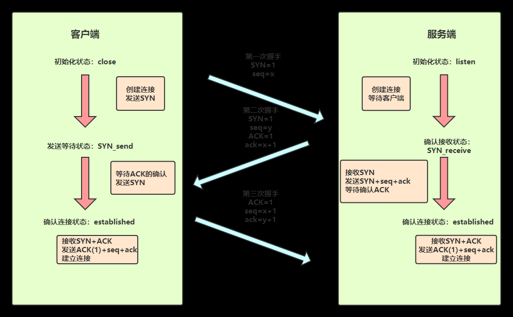
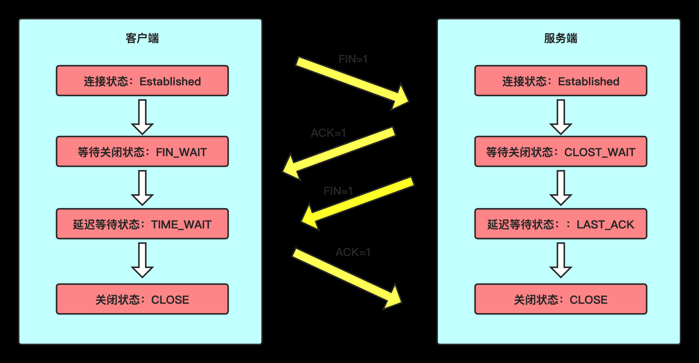
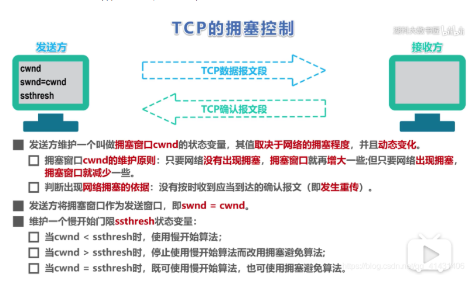
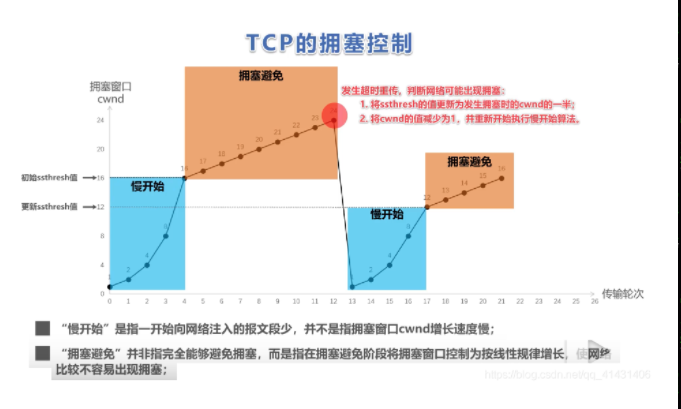
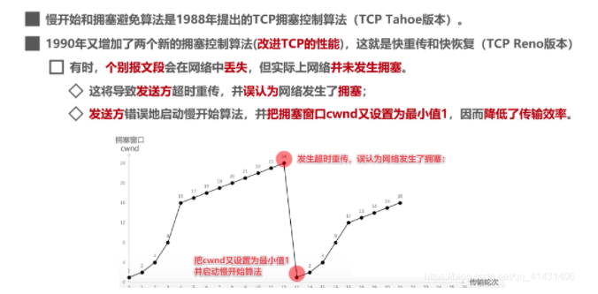
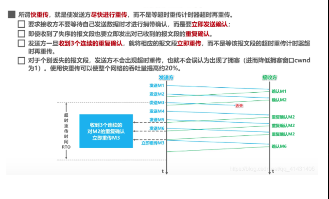
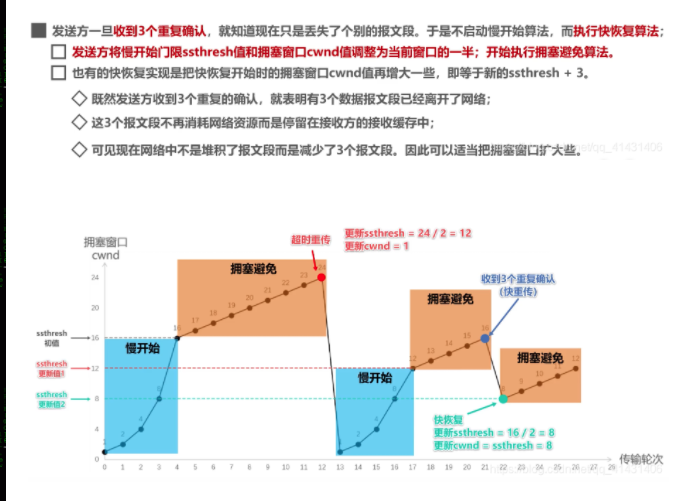

#TCP/UDP
[TOC]

##TCP
###TCP是什么？
>TCP(Transmission Control Protocol 传输控制协议) 是一种==面向连接的，可靠的，基于字节流==的传输层通信协议

###TCP头部报文
  

**source port 和 destination port**
> 两者分别为[源端口号]和[目的端口号]。源端口号就是指本地端口，目的端口就是远程端口。

可以这么理解，我们以后很多软件，每个软件对应一个端口，例如，你想和我数据交互，咱们得互相知道你我的端口号。

再来一个很官方的：
>扩展：应用程序的端口号和应用程序所在主机的IP地址统称为 socket(套接字),IP:端口号，在互联网上socket唯一标识每一个应用程序， 源端口+源IP+目的端口+目的IP称为“套接字对”，一个套接字就是一个连接，一个客户端与服务器之间的连接。

**Sequence Number**
>称为[序列号]。用于TCP通信过程中某一传输方向上字节流的每个字节的编码，为了确保数据通信的有序性，避免网络中乱序的问题。接收端根据这个编号进行确认，保证分割的数据段在原始数据包的位置。初始序列号由自己定，而后续的序列号由另一端的ACK决定: SN_x=ACK_y(x的序列号=y发给x的ACK)。

说白了，类似于身份证一样，而且还得发送此时此刻的所在的位置，就相当于身份证上的地址一样。

**Acknowledge Number**
> 称为[确认序列号]。确认序列号是接受确认端所期望收到的下一序列号。确认序号应当是上次已成功收到数据字节序号加1，只有当标志位中的ACK标志为1时候该确认序列号的字段才有效。主要用来解决不丢包的问题。

**TCP Flag**
TCP首部中有6个标志比特，它们中的多个可同时被设置为1，主要是用于操控 TCP的状态机的,依次为  > URG,ACK,PSH,RST,SYN,FIN。
只介绍三个：

1. ACK：这个标识可以理解为发送端发送数据到接收端，发送的时候 ACK 为 0，标识接收端还未应答，一旦接收端接收数据之后，就将 ACK 置为 1，发送端接收到之后，就知道了接收端已经接收了数据。
2. SYN：表示「同步序列号」，是 TCP 握手的发送的第一个数据包。用来建立 TCP 的连接。SYN 标志位和 ACK 标志位搭配使用，当连接请求的时候，SYN=1，ACK=0连接被响应的时候，SYN=1，ACK=1；这个标志的数据包经常被用来进行端口扫描。扫描者发送一个只有 SYN 的数据包，如果对方主机响应了一个数据包回来 ，就表明这台主机存在这个端口。
3. FIN：表示发送端已经达到数据末尾，也就是说双方的数据传送完成，没有数据可以传送了，发送FIN标志位的 TCP 数据包后，连接将被断开。这个标志的数据包也经常被用于进行端口扫描。发送端只剩最后的一段数据了，同时要告诉接收端后边没有数据可以接受了，所以用FIN标识一下，接收端看到这个FIN之后，哦！这是接受的最后的数据，接受完就关闭了；TCP四次分手必然问。

**Window size**
>称为滑动窗口大小。所说的滑动窗口，用来进行流量控制。

##TCP三次握手
  

* **初始状态**：客户端处于close(关闭)状态，服务器处于listen(监听)状态。
* **第一次握手**：客户端发送请求报文讲 SYN=1同步序列号 和初始化序列号seq=x （x为任意值）发送给服务端，发送完之后 客户端处于 SYN_send状态。
* **第二次握手**：服务端收到 SYN 请求报文之后，如果同意连接，会以自己的同步序列号SYN(服务端) = 1、初始化序列号 seq = y和确认序列号（期望下次收到的数据包）ack = x + 1 以及确认号ACK = 1报文作为应答，服务器为SYN_Receive状态。（问题来了，两次握手之后，所以老哥，你需要给我三次握手来传个话告诉我一声。你要是不告诉我，万一我认为你跑了，然后我可能出于安全性的考虑继续给你发一次，看看你回不回我。）
* **第三次握手**： 客户端接收到服务器的 SYN+ACK之后，知道可以发送下一序列的数据包了，然后发送同步序列号 ack=y+1 和数据包的序列号 seq=x+1以及确认号 ACK=1 确认宝作为应答，客户端转为 established 状态。

1. 你吃饭了嘛？（seq=x），收到请回答（SYN=1）
2. 收到（ACK=1），吃饭了（ack=x+1），你吃饭了吗？（seq=y），收到请回答（SYN=1）
3. 收到（ACK=1），吃饭了（ack=y+1），那么我们聊一下接下里的事情（established）

##TCP四次挥手
  

* **初始化状态**：客户端和服务端都在连接状态，接下来开始进行四次挥手断开连接操作。
* **第一次挥手**: 第一次挥手无论是客户端还是服务端都可以发起，因为 TCP 是全双工的。

>假如客户端发送的数据已经全部发送完毕，发送FIN=1 **告诉服务端，客户端所有数据已经全发完了，服务端你可以关闭接受了**，但是如果你们服务端有数据要发给客户端，客户端照样可以接受的。此时客户端处于FIN=1等待服务端确认释放连接状态。

* **第二次挥手**：服务端接收到客户端的 释放连接之后，**知道客户端没有数据要发给自己了，然后服务端发送ACK=1告诉客户端收到你发给我的信息息**，此时服务端处于 CLOSE_WAIT 等待关闭状态。 （服务端先回应给客户端一声，我知道了，但服务端发送数据能力即将等待关闭，于是接下来第三次就来了）

* **第三次挥手**：此时服务端向客户端把所有的数据发送完了，然后发送一个 FIN=1,告诉客户端，服务端的所有数据发送完毕，客户端也可以关闭接受数据连接了。 此时服务端处于LAST_ACK 状态，来等待确认客户端是否收到了自己的请求。(服务端等客户端回复是否收到呢，不受到的话，服务端不知道客户端是不是挂掉了还是咋回事呢)

* **第四次挥手**：此时如果客户端收到了服务端发送完的信息之后，就发送ACK=1,告诉服务端，客户端已经收到了你的信息。 有一个 2 MSL等待延时。

###为什么要有2MSL等待延迟？
对应这样一种情况，最后客户端发送的ACK=1给服务端的过程中丢失了， 服务端没收到，服务端怎么认为的？我已经发送完数据了，怎么客户端没回应我？是不是中途丢失了？然后服务端再次发起断开连接的请求，一个来回就是 2MSL。

客户端给服务端发送的ACK = 1丢失，服务端等待 1MSL没收到，然后重新发送消息需要1MSL。如果再次接收到服务端的消息，则重启2MSL计时器，发送确认请求。客户端只需等待2MSL，如果没有再次收到服务端的消息，就说明服务端已经接收到自己确认消息；此时双方都关闭的连接，TCP 四次分手完毕

###为什么四次分手？
任何一方都可以在数据传送结束后发出连接释放的通知，待对方确认后进入半关闭状态。当另一方也没有数据再发送的时候，则发出连接释放通知，对方确认后就完全关闭了TCP连接。举个例子：A 和 B 打电话，通话即将结束后，A 说“我没啥要说的了”，B回答“我知道了”，但是 B 可能还会有要说的话，A 不能要求 B 跟着自己的节奏结束通话，于是 B 可能又巴拉巴拉说了一通，最后 B 说“我说完了”，A 回答“知道了”，这样通话才算结束。

##TCP协议如何保证可靠传输？
* **确认和重传**：接受方收到报文就会确认，发送方发送一段时间后没有收到确认就会重传。
* **数据校验**：TCP报文头有校验和，用于校验报文是否损坏。
* **数据合理分片和排序**： tcp会按最大传输单元（MTU）合理分片，接收方会缓存未按序到达的数据，重新排序后交给应用层。 而UDP： IP 数据报大于1500字节，大于MTU。这个时候发送方的IP层就需要分片，把数据报分成若干片，是的每一片 都小于 MTU。 而接收方需要进行数据报的重组。由于UDP的特性，某一片数据丢失时，接收方便无法重组数据报，导致丢弃整个UDP数据报。
* **流量控制**：当接收方来不及处理发送方的数据，能通过滑动窗口，提示发送方降低发送的速率，防止包丢失。
* **拥塞控制**：当网络拥塞时，通过拥塞窗口，减少数据的发送，防止包丢失。

###TCP利用滑动窗口实现流量控制的机制？
>流量控制是为了控制发送方发送速率，保证接收方来得及接收。TCP利用滑动窗口实现流量控制。

TCP 中采用滑动窗口来进行传输控制，滑动窗口的大小意味着接收方还有多大的缓冲区可以用于接收数据。发送方可以通过滑动窗口的大小来确定应该发送多少字节的数据。当滑动窗口为 0 时，发送方一般不能再发送数据报，但有两种情况除外，一种情况是可以发送紧急数据。
>例如，允许用户终止在远端机上的运行进程。另一种情况是发送方可以发送一个 1 字节的数据报来通知接收方重新声明它希望接收的下一字节及发送方的滑动窗口大小。

###TCP拥塞控制的机制以及算法？
>在某段时间，若对网络中某一资源的需求超过了该资源所能提供的可用部分，网络的性能就要变坏。这种情况就叫拥塞。

TCP 发送方要维持一个 拥塞窗口(cwnd) 的状态变量。拥塞控制窗口的大小取决于网络的拥塞程度，并且动态变化。发送方让自己的发送窗口取为拥塞窗口和接收方的接受窗口中较小的一个。TCP的拥塞控制采用了四种算法，即 **慢开始** 、 **拥塞避免** 、**快重传** 和 **快恢复**。在网络层也可以使路由器采用适当的分组丢弃策略（如主动队列管理 AQM），以减少网络拥塞的发生。
  

==TCP的拥塞控制（详解）==
https://blog.csdn.net/qq_41431406/article/details/97926927

#### 慢开始
假设当前发送方拥塞窗口cwnd的值为1，发送窗口swnd=cwnd，因此发送方只能发送一个数据报文段，接收方收到数据报文段后，返回一个确认报文段，发送方收到确认报文段后，cwnd变为2。
> 接下来就是cwnd 变为4，变为8，变为16。

而之后的cwnd 大于慢开始门限值 ，之后该用拥塞避免算法

#### 拥塞避免
每个传输轮次，拥塞窗口cwnd只能线性加一，而不像慢开始算法时，指数增长。而如果后续发现超时计数器超时了，发送方判断出现拥塞，更改cwnd和ssthresh，并重新开始慢开始算法。

#### 快重传

#### 快恢复

## UDP
提供 **无连接**的，尽最大努力的数据传输服务(不保证数据传输的可靠性)

### UDP的特点
* UDP是**无连接的**;
* UDP使用**尽最大努力交付**，即不保证可靠交付，因此主机不需要维持复杂的链接状态
* UDP是**面向报文的**；
* UDP没有拥塞控制，因此网络出现拥塞不会使 源主机的发送速率降低 （对实时应用很有用，如IP电话，实时视频会议等）；
* UDP支持 **一对一，一对多，多对一和多对多的交互通信**;
* UDP 的首部开销小，只有8个字节，比TCP的20字节的首部要短。
### TCP特点
* **TCP是面向连接的**。（就好像打电话一样，通话前需要先拨号建立连接，通话结束后要挂机释放连接）;
* 每一条TCP连接只能有两个端点，每一条TCP 连接只能是点对点的(**一对一**)；
* TCP**提供可靠交付的服务**。通过TCP连接传输的数据，无差错，不丢失，不重复，并且按序到达；
* TCP提供**全双工通信**。 TCP允许通信双方的应用进程在任何时候都能发送数据。TCP连接的两端都设有发送缓存和接收缓存，用来临时存放双方通信的数据
* **面向字节流**。TCP的“流”(stream)指的是流入进程或从进程流出的字节序列。 “面向字节流”的含义是：虽然应用程序和TCP的交互是一次一个数据块（大小不等），但TCP把应用程序交下来的数据仅仅看成是一连串的无结构的字节流。

