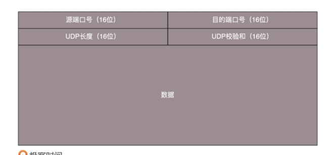

# UDP

## TCP 和 UDP 有哪些区别？

TCP 是面向连接的， UDP 是面向无连接的。

**所谓的建立连接，是为了在客户端和服务端维护连接，而建立一定的数据结构来维护双方交互的状态，用这样的数据结构来保证所谓的面向连接的特性。**

由于TCP 就维护了这样一个数据结构，就可以做到 拥塞控制等等。

TCP其实是一个**有状态服务**，通俗地讲有脑子的，里面精确地记着发送了没有，接收到没有，发送到哪个了，应该接受哪个了，错一点儿不行。而 **UDP 则是无状态服务**。 通俗地说是没脑子的，天真无邪地，发出去就发出去了。

## UDP 包头是什么样地？

当发送的UDP包到达目标机器后，发现MAC地址匹配，于是就取下来，将剩下的包传给处理IP
层的代码。把IP头取下来，发现目标IP匹配，接下来呢？这里面的数据包是给谁呢？

发送的时候，我知道我发的是一个UDP的包，收到的那台机器咋知道的呢？在IP头里面有个8位协议，这里会存放，数据里面到底是TCP还是UDP,这里是UDP。 于是，如果我们知道UDP头的格式，就能从数据里面，将它解析出来。解析出来以后呢？数据给谁处理呢？

无论应用程序写的使用TCP传数据，还是UDP传数据，都要监听一个**端口**。正是这个端口，用来区分应用程序。

当看到UDP 包头的时候，发现的确有端口号，有源端口号和目标端口号。

但是发现，UDP除了端口号，没有其他的了。

## UDP 的三大特点

* **沟通简单**，不需要一肚子花花肠子(大量的数据结构，处理逻辑，包头字段)。前提是它相信网络世界是美好的，秉承性善论，相信网络通路默认就是很容易送达的，不容易被丢弃的。

* **轻信他人**。它不会建立连接，虽然有端口号，但是监听在这个地方，谁都可以传给他数据，他也可以传给任何人数据，甚至可以同时传给多个人数据。

* **愣头青，做事不懂权变**。不知道什么时候该坚持，什么时候该退让。它不会根据网络的情况进行发包的拥塞控制，无论网络丢包丢成啥样了，它该怎么发还怎么发。

## UDP的三大使用场景

第一，**需要资源少，在网络情况比较好的内网，或者对于丢包不敏感的应用**。

第二，**不需要一对一沟通，建立连接，而是可以广播的应用**。

第三，**需要处理速度快，时延低，可以容忍少数丢包，但是要求即便网络拥塞，也毫不退缩，一往无前的时候。**

