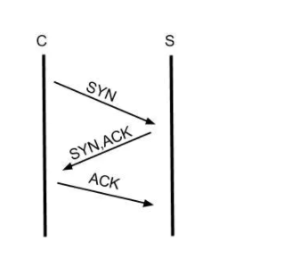

[toc]
# Keep Alive 详解

## 什么是 KeepAlive？

* TCP 的 **KeepAlive** 侧重在保持客户端和服务端的连接，一方会不定期发送心跳包给另一方，当一方断掉的时候，没有断掉的定时发送几次心跳包，如果间隔发送几次，对方都返回的是RST,而不是ACK，那么就释放当前链接。 设想一下，如果tcp层没有keepAlive 的机制，一旦一方断开连接却没有发送给FIN给另外一方的时候，那么另外一方会一直以为这个连接还是存活的，几天，几月，对服务器的资源的影响还是很大的。

* HTTP 的 **keep-alive** 一般中间会带上中间的斜杠，普通的http 连接时客户端连接上服务端，然后结束请求后，由客户端或者服务端进行http 连接的关闭。 下次再发送请求的时候，客户端再发起一个连接，传送数据，关闭连接。  这个流程一直反复，但是，但是客户端发送connection：keep-alive 头给服务端，且服务端也接受这个keep-alive的话，两边对上暗号，这个连接就可以复用了，一个http处理完之后，另外一个http数据直接从这个连接走了。减少新建和断开tcp的消耗。

二者的作用简单来说：
> HTTP协议的Keep-Alive 意图在于短时间连接复用，希望可以短时间再同一个连接上进行多次请求/响应。
> TCP的KeepAlive 机制 意图在于保活，心跳，检测连接错误，当一个tcp连接两端长时间没有数据传输时（通常配置是2小时），发送keepalive探针，探测链接是否存货。

## TCP的KeepAlive

### 为什么需要KeepAlive

三次握手建立连接后，如果应用程序一直不发送数据，或者隔很久才发送一次数据，这样不知道对方是否在线，那么是否需要保持这个连接是需要考虑的。

而KeepAlive 自动定时发送一个数据为空的报文给对方，如果对方回应了这个报文，说明对方还在线，链接可以继续保持，如果没有报文返回，并且重试了多次就认为链接丢失，没有必要保持连接。

### 怎么开启KeepAlive？

TCP keepalive 机制依赖于操作系统的实现,灵活性不够，默认关闭，且默认的 keepalive 心跳时间是 两个小时, 时间较长。

TCP的探活程序只能保证链路正常存活，但无法得知通信双方的应用层是否正常，比如通信双方虽然能互相交流数据，但服务端可能已经报了空指针异常，或者OOM了，或者死锁了，响应码5xx了。

## HTTP的keep-alive

### 网页为什么需要keep-alive？
通常一个网页 可能会有很多组成部分，除了文本内容，还有注入：js，css ，图片等静态资源，只有所有的资源都加载完毕后，我们看到网页完整的内容。然而，如果每请求一个资源，就创建一个连接，然后关闭，代价就会很大。

因此，希望连接在短时间内得到复用，在加载一个网页的内容时，尽量的复用连接，这就是HTTP协议中keep-alive 属性的作用。

* HTTP 的 Keep -Alive 时HTTP1.1中默认开启的功能。通过headers设置“Connection：close” 关闭
* 在Http1.0 中是默认关闭的，通过headers 设置 Connection：Keep-Alive 开启

为了避免资源浪费的情况，web 服务软件一般都会提供keepalive_timeout 参数，用来指定 HTTP 长连接的超时时间。

比如设置了 HTTP 长连接的超时时间是 60 秒，web 服务软件就会启动一个定时器，如果客户端在完后一个 HTTP 请求后，在 60 秒内都没有再发起新的请求，定时器的时间一到，就会触发回调函数来释放该连接。