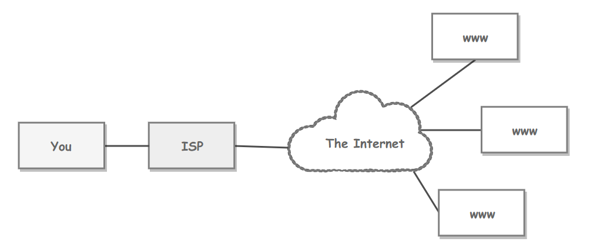
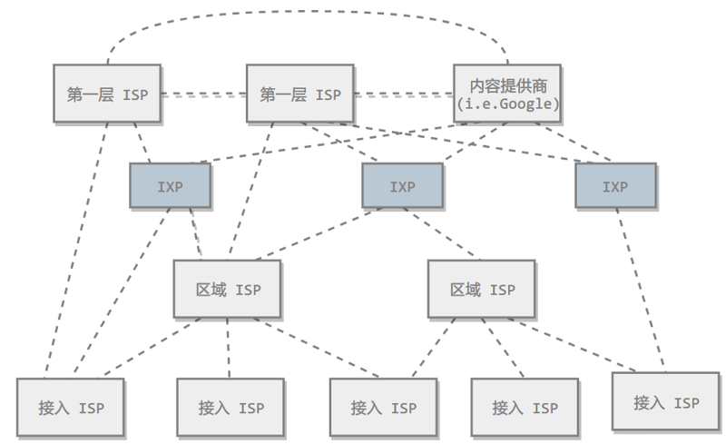
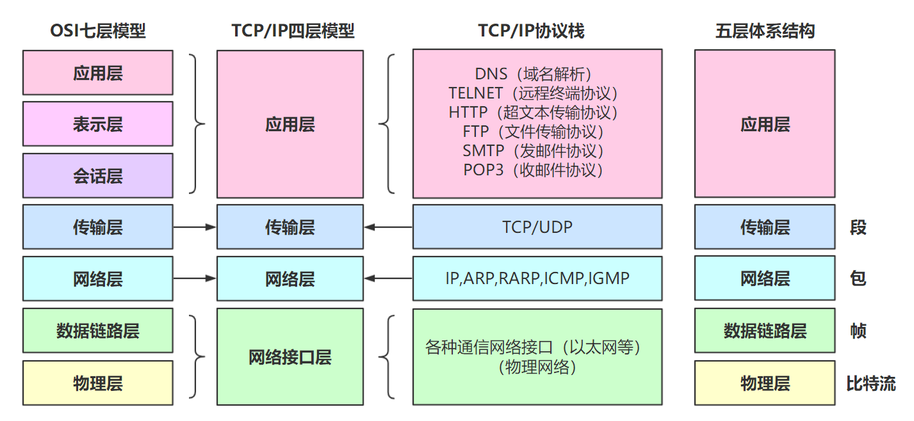
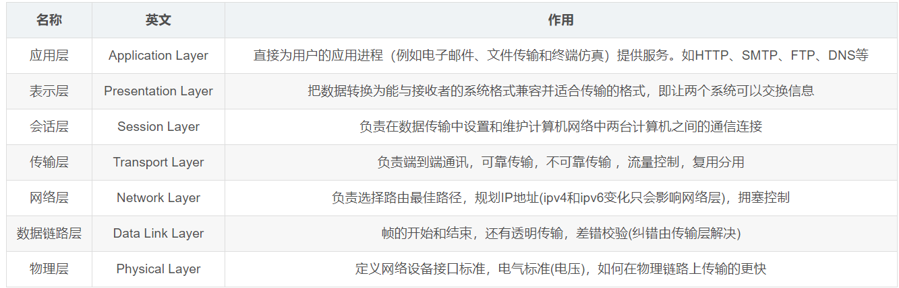
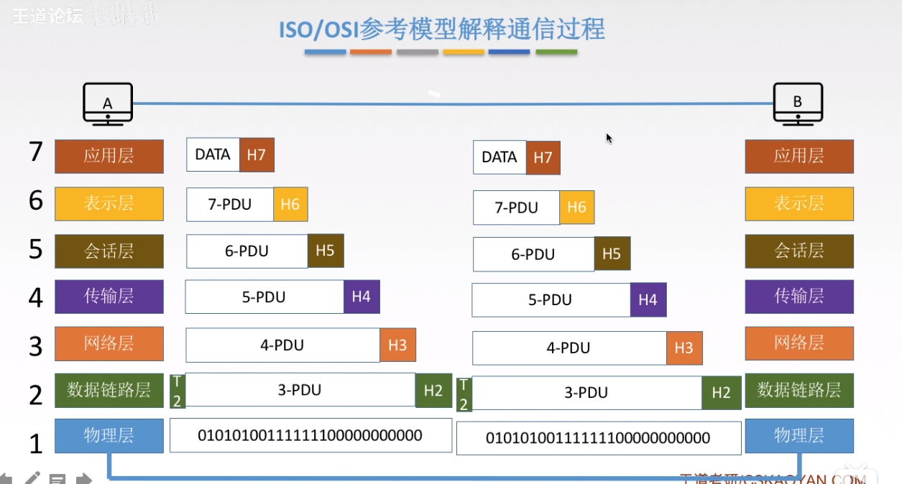

#网络基础与物理层

##ISP
互联网服务商提供商ISP可以从互联网管理机构获得许多**IP地址**，同时拥有通信线路以及路由器等联网设备，个人或机构向ISP缴纳一定的费用就可以接入互联网。

目前的互联网是一种**多层次 ISP 结构**，ISP 根据覆盖面积的大小分为第一层 ISP、区域 ISP 和接入 ISP。互联网交换点 IXP 允许两个 ISP 直接相连而不用经过第三个 ISP。

##主机之间的通信方式
* 客户-服务器模式(C/S)：客户是服务的请求方，服务器是服务的提供方。

* 对等模式（P2P）：不区分客户和服务器。

##计算机网络体系结构

###OSI七层协议
七层协议

###OSI流程简介
网络层及以上，每一层都要对上一层发送的数据进行处理（加个头部）
数据链路层不仅需要加头部，还需要加尾部
物理层什么都不加，只管发送数据（比特流）

###五层标准模型
五层协议没有表示层和会话层，而是将这些功能留给应用程序开发者处理。

* **物理层**：考虑的是怎样在传输媒体上传输数据比特流，而不是指具体的传输媒体。物理层的作用是尽可能屏蔽传输媒体和通信手段的差异，使数据链路层感觉不到这些差异。

* **数据链路层**：网络层针对的还是**主机之间的数据传输**服务，而主机之间可以有很多链路，**链路层协议就是为同一链路的主机提供数据传输服务**。数据链路层把网络层传下来的分组封装成帧。链路层协议 有**PPP协议，CSMA/CD协议等**

* **网络层**：为主机提供数据传输服务。网络层的任务就是选择合适的网间路由和交换结点， 确保数据及时传送。网络层协议主要有 IP 协议，ARP 协议等。
* **传输层**：为**进程**提供通用数据传输服务。运输层包括两种协议：传输控制协议 TCP，提供面向连接、可靠的数据传输服务，数据单位为报文段；用户数据报协议 UDP，提供无连接、尽最大努力的数据传输服务，数据单位为用户数据报。TCP 主要提供完整性服务，UDP 主要提供及时性服务。

* **应用层**：为特定应用程序提供数据传输服务，例如**HTTP,DNS等协议**。数据单位为**报文**

### TCP/IP
它只有四层，相当于五层协议中数据链路层和物理层合并为**网络接口层**。TCP/IP体系结构不严格遵循OSI分层概念，应用层可能会直接使用IP层或者网络接口层。

### 数据在各层之间的传递过程
在 **向下的**过程中，需要添加下层协议所需要的首部或者尾部，而在向上的过程中不断拆开首部和尾部。

####通信方式
根据信息在传输线上的传送方向，分为以下三种通信方式：
* 单工通信：单向传输
* 半双工通信：双向交替传输
* 全双工通信：双向同时传输

#### 带通调制
模拟信号是连续的信号，数字信号是离散的信号。带通调制把数字信号转换为模拟信号。

#### 电路交换与分组交换
* **电路交换**
电路交换用于电话通信系统，两个用户要通信之前需要建立一条专用的物理链路，并且在整个通信过程中始终占用该链路。由于通信的过程中不可能一直在使用传输线路，因此电路交换对线路的利用率很低，往往不到 10%。
* **分组交换**
每个分组都有首部和尾部，包含了源地址和目的地址等控制信息，在同一个传输线路上同时传输多个分组互相不会影响，因此在同一条传输线路上允许同时传输多个分组，也就是说分组交换不需要占用传输线路。

    在一个邮局通信系统中，邮局收到一份邮件之后，先存储下来，然后把相同目的地的邮件一起转发到下一个目的地，这个过程就是存储转发过程，分组交换也使用了存储转发过程。
* 时延