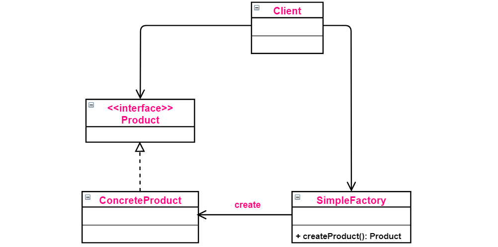
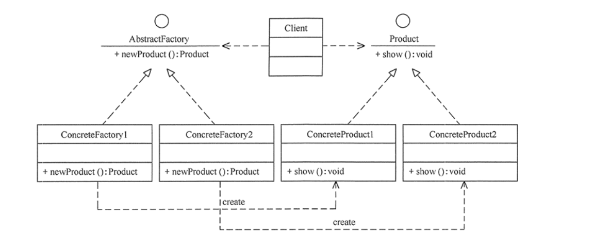
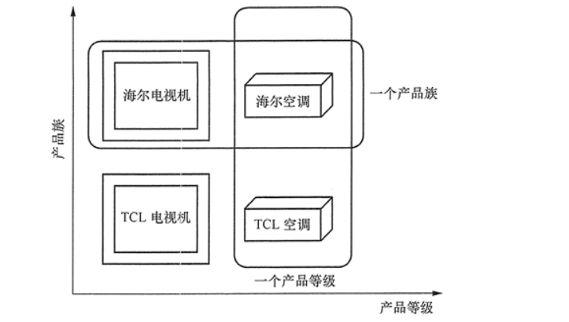
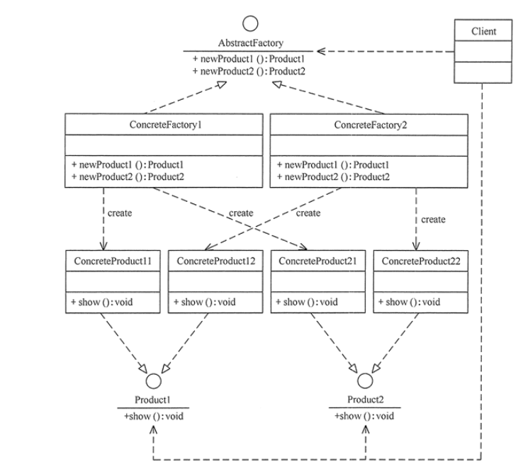
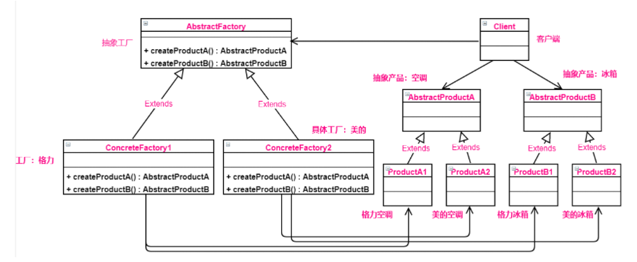
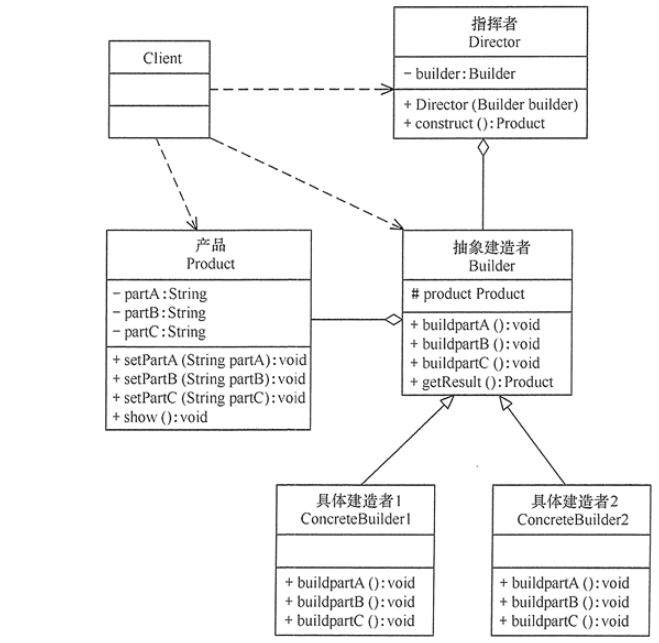

#创建型模式
##创建型模式概述
* [单例模式](#Singleton):某个类只能生成一个实例，该类提供了一个全局访问点供外部获取该实例，其拓展是有限多例模式。
* [原型模式](#Prototype):将一个对象作为原型，通过对其进行复制而克隆出多个和原型类似的新案例
* [工厂方法模式](#FactoryMethod):定义一个用于创建产品的接口，由子类决定生产什么产品。
* [抽象工厂模式](#AbstractFactory):提供一个创建产品族的接口，由每个子类决定生产一系列的产品。
* [建造者模式](#Builder):将一个复杂对象分解成多个相对简单的部分，然后根据不同需要分别创建它们，最后构建出该复杂对象。

##<span id="Singleton">单例模式</span>

##<span id="Prototype">原型模式</span>


##简单工厂模式(Simple Factory)
1.概述(不属于23种设计模式)
在**创建一个对象时**不向客户暴露内部细节，并提供一个**创建对象的通用接口**。简单工厂把**实例化**的操作单独放到一个类中，这个类就成了**简单工厂类**，让**简单工厂类**来决定应该实例化哪个具体子类。 
**创建对象的任务交给简单工厂。**

这样做能把客户类和具体子类的实现解耦，**客户类不再需要知道有哪些子类以及应当实例化哪个子类**。客户类往往有多个，如果不使用简单工厂，那么所有的客户类都要知道所有子类的细节。而且一旦子类发生改变，例如增加子类，那么所有的客户类都要进行修改。

2.类图
  

3.实现
```Java
// 产品接口
public interface Product {
}
```
Product的三种实现：
```Java
public class ConcreteProduct implements Product {
}
public class ConcreteProduct1 implements Product {
}
public class ConcreteProduct2 implements Product {
}

```
以下的Client类包含了实例化的代码，这是一种错误的实现。如果在客户类中存在这种实例化的代码，就需要考虑将代码放到简单工厂里。
不好的实现😓
```Java
public class Client {
    
    public static void main(String[] args) {
        int type = 1;
        // 自己定义产生Product对象
        Product product;
        if (type == 1) {
            product = new ConcreteProduct1();
        } else if (type == 2) {
            product = new ConcreteProduct2();
        } else {
            product = new ConcreteProduct();
        }
        // do something with the product
    }
}

```
简单工厂实现SimpleFactory，被所有需要进行实例化的**客户类**调用
```Java
// 简单工厂类
public class SimpleFactory {
    /**
     * 根据类型获取对象 统一使用其接口来表示
     * 
     * @param type 类型
     * @return 产品对象
     */
    public Product createProduct(int type) {
        if (type == 1) {
            return new ConcreteProduct1();
        } else if (type == 2) {
            return new ConcreteProduct2();
        }
        return new ConcreteProduct1();
    }
}
// 客户类
public class Client {
    public static void main(String[] args) {
        // 构造简单工厂
        SimpleFactory simpleFactory = new SimpleFactory();
        // 往工厂传入产品类型得到产品对象
        Product product = simpleFactory.createProduct(1);	
        // do something with the product
    }
}
```

##<span id="FactoryMethod">工厂方法模式</span>
1.概述
**工厂方法模式 是对简单工厂模式的进一步抽象化**，其好处是可以 使系统在不修改原来代码的情况下爱引入新的产品，即满足开闭原则。

在简单工厂模式中，创建对象的是**工厂类**， 而在工厂方法模式中， 是由** 具体工厂来创建对象**
2.类图
  
组成：
* **抽象工厂**（AbstractFactory）:提供了创建产品的接口，调用者通过访问它具体工厂的工厂方法 newProduct()来创建产品。
* **具体工厂**（ConcreteFactory）:主要是实现抽象工厂中的抽象方法，完成具体产品的创建
* **抽象产品**（Product）:定义了产品的规范，描述了产品的主要特性和功能
* **具体产品**（Product的实现类）：实现了抽象产品角色所定义的接口，由具体工厂来创建，它同具体工厂之间一一对应。

3.实现
抽象工厂类：
```Java
/抽象工厂：提供了厂品的生成方法
interface AbstractFactory {
    public Product newProduct();
}

```
之后下面有几个  **小工厂**，负责产生具体的对象，而不是像简单工厂模式那样把全部都综合在一个类中，这些小工厂复写了抽象工厂的工厂方法，用于产生实际的对象。
```Java
//具体工厂1：实现了产品的生成方法
class ConcreteFactory1 implements AbstractFactory {
    public Product newProduct() {
        System.out.println("具体工厂1生成-->具体产品1...");
        return new ConcreteProduct1();
    }
}
//具体工厂2：实现了产品的生成方法
class ConcreteFactory2 implements AbstractFactory {
    public Product newProduct() {
        System.out.println("具体工厂2生成-->具体产品2...");
        return new ConcreteProduct2();
    }
}
```
抽象产品
```Java
/抽象产品：提供了产品的接口
interface Product {
    public void show();
}

```
具体产品
```Java
/具体产品1：实现抽象产品中的抽象方法
class ConcreteProduct1 implements Product {
    public void show() {
        System.out.println("具体产品1显示...");
    }
}
//具体产品2：实现抽象产品中的抽象方法
class ConcreteProduct2 implements Product {
    public void show() {
        System.out.println("具体产品2显示...");
    }
}
```

工厂方法的灵活性增强，对于新产品的创建，无需修改代码，而是直接添加一个工厂类。

但是工厂方法的缺点是每增加一个产品类，就需要增加一个对应的工厂类


##<span id="AbstractFactory">抽象工厂模式（Abstract Factory）</span>
1.概述
* 抽象工厂模式与工厂方法模式的区别
工厂方法一个工厂只生产一个产品，然而 **抽象工厂** 生产的是多等级的产品。例如如下图所示，抽象工厂生产的是一个产品族。
  

2.应用场景
抽象工厂的常见场景
* 当需要创建的对象是一系列相互关联或相互依赖的产品族时，如电器工厂中的电视机、洗衣机、空调等。
* 系统中有多个产品族，但每次只使用其中的某一族产品。如有人只喜欢穿某一个品牌的衣服和鞋。
* 系统中提供了产品的类库，且所有产品的接口相同，客户端不依赖产品实例的创建细节和内部结构。
  
3.类图
  
抽象工厂模式的主要角色如下：
1.抽象工厂（Abstract Factory）:提供了创建产品的接口，它包含了多个创建产品的方法
newProduct(),可以创建多个不同等级的产品。
2.具体工厂（Concrete Factory）:主要是实现抽象工厂中的多个抽象方法，完成具体产品的创建。
3.抽象产品。（Product）:定义了产品的规范，描述了产品的主要特性和功能，抽象工厂模式有多个抽象产品，
4.具体产品（ConcreteProduct）:实现了抽象产品角色所定义的接口，由具体工厂来创建，它同具体工厂之间是多对一的关系。
  
4.实现
两个抽象产品系列。
```Java
// 抽象产品A：如空调
public class AbstractProductA {
}
// 抽象产品B：如冰箱
public class AbstractProductB {
}
```
假设一个**抽象产品有两个不同的实际产品**。
```Java
// 实际产品A1 
public class ProductA1 extends AbstractProductA {
}
// 实际产品A2
public class ProductA2 extends AbstractProductA {
}
// 实际产品B1
public class ProductB1 extends AbstractProductB {
}
// 实际产品B2
public class ProductB2 extends AbstractProductB {
}
```
将上述产品进行组合。
```Java
// 组合成抽象工厂
public abstract class AbstractFactory {
    /**
     * 获取产品系列的抽象方法
     */
    abstract AbstractProductA createProductA();
    abstract AbstractProductB createProductB();
}
// 具体工厂1 如：格力工厂
public class ConcreteFactory1 extends AbstractFactory {
	// 实现工厂方法A
    @Override
    AbstractProductA createProductA() {
        return new ProductA1();
    }

	// 实现工厂方法B
    @Override
    AbstractProductB createProductB() {
        return new ProductB1();
    }
}
// 具体工厂2 如：美的工厂
public class ConcreteFactory2 extends AbstractFactory {
    // 实现工厂方法A
    @Override
    AbstractProductA createProductA() {
        return new ProductA2();
    }
    
	// 实现工厂方法B
    @Override
    AbstractProductB createProductB() {
        return new ProductB2();
    }
}
public class Client {
    public static void main(String[] args) {
        // 得到具体工厂1
        AbstractFactory abstractFactory = new ConcreteFactory1();
        // 得到工厂1产生的产品A
        AbstractProductA productA = abstractFactory.createProductA();
        // 得到工厂1产生的产品B
        AbstractProductB productB = abstractFactory.createProductB();
        // do something with productA and productB
    }
}

```
抽象工厂最大的好处是**易于交换产品系列**。抽象工厂模式的另一个好处就是它让具体的创建实例过程与客户端分离。客户端是通过它们的抽象接口操作实例，产品实现类的具体类名也被具体的工厂实现类分离，不会出现在客户端代码中。

##建造者模式
1.概述
封装一个对象的  **构造过程**，并允许按**步骤**构造。适用于构造复杂对象的一种模式。
它是将一个复杂对象的构造 与它的表示分离，使同样的构造过程可以创建不同的表示（spring？的依赖注入）

使用 Builder 模式来替代多参数构造函数是一个比较好的实践法则。常常会面临编写一个有多个构造函数的实现类(假设类名叫 User)，如下：
```Java
User(String name);
User(String name, int age);
User(String name, int age, String address);
User(String name, int age, String address, int cardID);

```
这样一系列的构造函数主要目的是为了提供更多的客户调用选择，已处理不同的构造请求，这种方法很常见，也很有效力，但是缺点很多。


编码时需要写多种参数组合的构造函数，而且其中还需要设置默认参数值，这是一个需要细心而又枯燥的工作。其次，这样的构造函数灵活性也不高，而且在调用时不得不提供一些没有意义的参数值，例如，User("Ace", -1, "SH")，显然年龄为负数没有意义，但是又不的不这样做，得以符合 Java 的规范。如果这样的代码发布后，后面的维护者就会很头痛，因为他根本不知道这个 -1 是什么含义。对于这样的情况，就非常适合使用 Builder 模式。

```
与工厂方法模式的区别：
建造者（Builder）模式和工厂模式的关注点不同：建造者模式注重零部件的组装过程，而工厂方法模式更注重零部件的创建过程，但两者可以结合使用。
```
2.使用场景
* 建造者（Builder）模式创建的是复杂对象，其产品的各个部分经常面临着剧烈的变化，但将它们组合在一起的算法却相对稳定，所以它通常在以下场合使用。

  * 创建的对象较复杂，由多个部件构成，各部件面临着复杂的变化，但构件间的建造顺序是稳定的。

  * 创建复杂对象的算法独立于该对象的组成部分以及它们的装配方式，即产品的构建过程和最终的表示是独立的。

3.类图
建造者（Builder）模式的主要角色如下。  
1. **产品角色**（Product）：它是包含多个组成部件的复杂对象，由具体建造者来创建其各个零部件
2. **抽象建造这者**（Builder）：它是一个包含创建产品各个子部件的抽象方法的接口，通常还包含一个返回复杂产品的方法 getResult().
3. **具体建造者**（Concrete Builder）：实现Builder接口，完成复杂产品的各个不见的具体创建方法。
4. **指挥者**（Director）：它调用建造者对象中的部件构造与装配方法完成复杂对象的创建，在指挥者中不涉及具体产品的信息。

4.模式的实现
* 产品角色
```Java
class Product {
    private String partA;
    private String partB;
    private String partC;
    public void setPartA(String partA) {
        this.partA = partA;
    }
    public void setPartB(String partB) {
        this.partB = partB;
    }
    public void setPartC(String partC) {
        this.partC = partC;
    }
    public void show() {
        //显示产品的特性
        System.out.println(this);
    }
    @Override
    public String toString() {
        return "Product{" +
                "partA='" + partA + '\'' +
                ", partB='" + partB + '\'' +
                ", partC='" + partC + '\'' +
                '}';
    }
}
```
* 抽象建造者:包含创建产品各个子部件的抽象方法。
```Java
abstract class Builder {
    //创建产品对象
    protected Product product = new Product();
    public abstract void buildPartA();
    public abstract void buildPartB();
    public abstract void buildPartC();
    //返回产品对象
    public Product getResult() {
        return product;
    }
}
```
* 具体建造者：实现了抽象建造者接口。
```java
public class ConcreteBuilder extends Builder {
     public void buildPartA() {
        product.setPartA("建造 PartA");
    }
    public void buildPartB() {
        product.setPartB("建造 PartB");
    }
    public void buildPartC() {
         product.setPartC("建造 PartC");
    }
}

```
* 指挥者：调用建造者的方法完成复杂对象的创建
```java
class Director {
    private Builder builder;
    public Director(Builder builder) {
        this.builder = builder;
    }
    //产品构建与组装方法
    public Product construct() {
        builder.buildPartA();
        builder.buildPartB();
        builder.buildPartC();
        return builder.getResult();
    }
}
```
* 客户类
```Java
  public class Client {
    public static void main(String[] args) {
        Builder builder = new ConcreteBuilder();
        Director director = new Director(builder);
        Product product = director.construct();
        product.show();
    }
}
```

