#结构型模式概述
>**结构型模式**描述如何将**类或对象按某种布局组成更大的结构**，就像搭积木，可以通过简单积木的组合形成复杂的、功能更为强大的结构。


结构型模式可以分为类结构和对象结构型模式：
* 类结构型模式关心类的组合，由多个类可以组合成一个更大的系统，在类结构型模式中一般只存在继承关系和实现关系。
* 对象结构性模式关心类与对象的组合，通过关联关系使得在一个类中定义另一个类的实例对象，然后通过该对象调用其方法。根据“合成复用原则”，在系统中尽量使用 关联关系来替代继承关系，因此大部分结构型模式都是对象结构型模式。

结构型模式分为以下 7 种：
1.[代理模式](#Proxy)：为某对象提供一种代理以控制对该对象的访问。即客户端通过代理间接地访问该对象，从而限制、增强或修改该对象的一些特性。
2.[适配器模式](#Adapter)：将一个类的接口转换成客户希望的另外一个接口，使得原本由于接口不兼容而不能一起工作的那些类能一起工作。
3.[桥接（Bridge）模式](#Bridge)：将抽象与实现分离，使它们可以独立变化。它是用组合关系代替继承关系来实现的，从而降低了抽象和实现这两个可变维度的耦合度。
4.[装饰（Decorator）模式](#Decorator)：动态地给对象增加一些职责，即增加其额外的功能。
5.[外观（Facade）模式](#Facade)：为多个复杂的子系统提供一个一致的接口，使这些子系统更加容易被访问。
6.[享元（Flyweight）模式](#Flyweight)：运用共享技术来有效地支持大量细粒度对象的复用。
7.[组合（Composite）模式](#Composite)：将对象组合成树状层次结构，使用户对单个对象和组合对象具有一致的访问性。


##<span id="Proxy">代理模式</span>
1.概述
由于某些原因需要给对象提供一个代理以控制对该对象的访问。这时，访问对象不适合或者不能直接引用目标对象，代理对象作为访问对象和目标对象之间的中介。（如想要访问某个类的方法时，在调用这个方法做前置处理，调用这个方法后做后置处理（Spring AOP））
分类：
* 静态代理：由程序员创建代理类或特定工具自动生成源代码在对其编译，在程序运行前代理类的.class就已经存在了
* 动态代理：在程序运行时，运用反射机制动态创建而成。

2.类图
  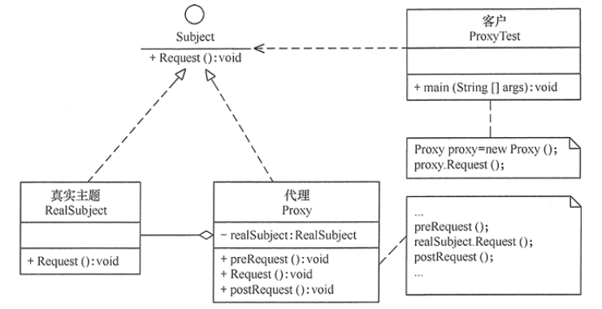  
 代理模式的主要角色如下（静态代理）：
 1.==抽象主题（Subject）类==：通过接口或抽象类声明真实主题和代理对象实现的业务方法。
 2.==真实主题（Real Subject）类==:实现了抽象主题的中的具体业务，是代理对象所代表的真实对象，是最终要引用的对象。
 3.==代理（Proxy）类==：提供了与真实主题相同的接口，其内部含有对真实主题的引用，它可以访问、控制或扩展真实主题的功能。

3.模式的运行
==静态代理方法==
```java
package proxy;
public class ProxyTest {
    public static void main(String[] args) {
        Proxy proxy = new Proxy();
        proxy.Request();
    }
}
//抽象主题
interface Subject {
    void Request();
}
//真实主题
class RealSubject implements Subject {
    public void Request() {
        System.out.println("访问真实主题方法...");
    }
}
//代理
class Proxy implements Subject {
    private RealSubject realSubject;
    public void Request() {
        if (realSubject == null) {
            realSubject = new RealSubject();
        }
        preRequest();
        realSubject.Request();
        postRequest();
    }
    public void preRequest() {
        System.out.println("访问真实主题之前的预处理。");
    }
    public void postRequest() {
        System.out.println("访问真实主题之后的后续处理。");
    }
}
```
==以下是一个虚拟代理的实现，模拟了图片延迟加载的情况下使用与图片大小相等的临时内容去替换原始图片，直到图片加载完成才将图片显示出来。==
图片接口
```java
public interface Image {
    void showImage();
}

```
高分辨图片类
```java
public class HighResolutionImage implements Image {

    private URL imageURL;
    private long startTime;
    private int height;
    private int width;

    public int getHeight() {
        return height;
    }

    public int getWidth() {
        return width;
    }

    public HighResolutionImage(URL imageURL) {
        this.imageURL = imageURL;
        this.startTime = System.currentTimeMillis();
        this.width = 600;
        this.height = 600;
    }
	// 是否加载
    public boolean isLoad() {
        // 模拟图片加载，延迟 3s 加载完成
        long endTime = System.currentTimeMillis();
        return endTime - startTime > 3000;
    }

    @Override
    public void showImage() {
        System.out.println("Real Image: " + imageURL);
    }
}
```
图片**代理 --> 实现了图片接口。**
```java
public class ImageProxy implements Image {
	// 传入被代理对象
    private HighResolutionImage highResolutionImage;

    public ImageProxy(HighResolutionImage highResolutionImage) {
        this.highResolutionImage = highResolutionImage;
    }
	
    // 实现加载图片方法
    @Override
    public void showImage() {
        // 如果没有下载好则等待一会儿
        while (!highResolutionImage.isLoad()) {
            try {
                System.out.println("Temp Image: " + highResolutionImage.getWidth() + " " + highResolutionImage.getHeight());
                Thread.sleep(100);
            } catch (InterruptedException e) {
                e.printStackTrace();
            }
        }
        // 下载好了加载图片
        highResolutionImage.showImage();
    }
}
```
测试
```java
public class Client {

    public static void main(String[] args) throws Exception {
        String image = "http://image.jpg";
        URL url = new URL(image);
        HighResolutionImage highResolutionImage = new HighResolutionImage(url);
        ImageProxy imageProxy = new ImageProxy(highResolutionImage);
        imageProxy.showImage();
    }
}
```


4.代理模式应用场景
* **安全代理**：这种方式通常用于控制不同种类客户对真实对象的访问权限。
* **远程代理**：通过代理类处理远程方法调用(RMI)。这种方法是为了隐藏目标对象存在于不同地址空间的事实。例如，用户申请某些网盘空间时，会在用户的文件系统中建立一个虚拟的硬盘，用户访问虚拟硬盘时实际访问的是网盘空间。
* **延迟加载**：先加载轻量级的代理对象，真正需要再加载真实对象。( 比如你要开发一个大文档查看软件，大文档中有大的图片，有可能一个图片有 100MB，在打开文件时不可能将所有的图片都显示出来，这样就可以使用代理模式，当需要查看图片时，用 proxy 来进行大图片的打开。)

5.动态代理
上面介绍的方法是静态代理，我们可以发现在静态代理中，代理类中包含了对真实主题的引用，如此一来 增加一个真实主题时，代理类也需要增加。而且 在设计代理时 ==真实主题== 必须存在，如此以来很不灵活。因此采用动态代理模式可以解决上述问题。
**动态代理**的 结构图如下图所示：
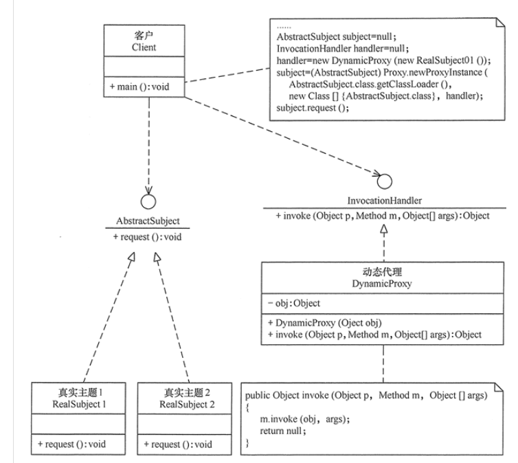  


##<span id="Adapter">适配器模式</span>
1.概述
==适配器==的定义如下：将一个**类接口**转换成另一个用户需要的接口。Adapter模式使得原本接口不兼容而不能一起工作的那些类可以一起工作。适配器可以分为==类结构性模式==和==对象结构型模式==两种，前者的耦合度比后者高，切要求程序员了解现有组件库中的相关足渐的内部结构，所以应用相对较少些。

在软件设计中也可能出现，需要开发的具有某种业务功能的组件和现有的组件库已经存在，但是它们与当前系统的接口规范不兼容，但是重新设计这些组件成本有很高，这时候用适配器模式就能够很好的解决这些问题。

==类适配器模式==可采用多重继承方式实现，如 C++ 可定义一个适配器类来同时继承当前系统的业务接口和现有组件库中已经存在的组件接口；Java 不支持多继承，但可以定义一个适配器类来实现当前系统的业务接口，同时又继承现有组件库中已经存在的组件。

==对象适配器模式==可釆用将现有组件库中已经实现的组件引入适配器类中，该类同时实现当前系统的业务接口。现在来介绍它们的基本结构。


2.类图
类适配器模式：
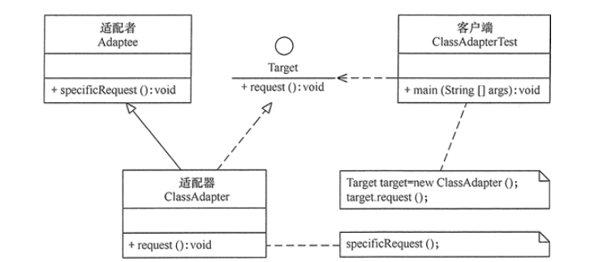  

对象适配器模式：
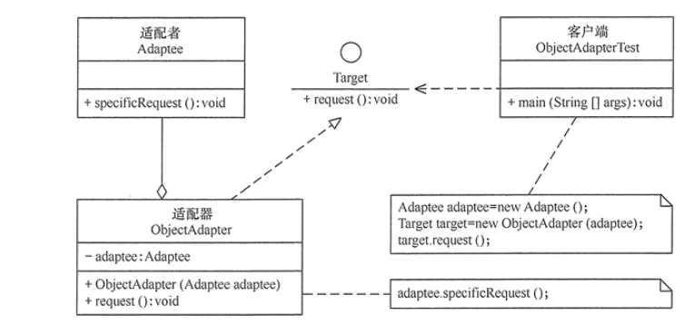  

适配器模式主要有三种角色：
1.**目标接口（Target）**：当前系统业务所期待的接口
2.**适配者类（Adaptee）**: 它是被访问和适配的现存组件库的组件接口。
3.**适配器（Adapter）类**： 它是一个转换器，通过继承或引用适配者的对象，把适配者接口转换成目标接口，让客户按目标接口的格式访问适配者。


3.模式实现
1）类适配器实现
```java
//目标接口
interface Target
{
    public void request();
}
//适配者接口
class Adaptee
{
    public void specificRequest()
    {       
        System.out.println("适配者中的业务代码被调用！");
    }
}
//类适配器类
class ClassAdapter extends Adaptee implements Target
{
    public void request()
    {
        specificRequest();
    }
}
//客户端代码
public class ClassAdapterTest
{
    public static void main(String[] args)
    {
        System.out.println("类适配器模式测试：");
        Target target = new ClassAdapter();
        target.request();
    }
}
```
运行结果如下：
>类适配器模式测试：
适配者中的业务代码被调用！

2)对象适配器
```java
class ObjectAdapter implements Target
{
    private Adaptee adaptee;
    public ObjectAdapter(Adaptee adaptee)
    {
        this.adaptee=adaptee;
    }
    public void request()
    {
        adaptee.specificRequest();
    }
}
//客户端代码
public class ObjectAdapterTest
{
    public static void main(String[] args)
    {
        System.out.println("对象适配器模式测试：");
        Adaptee adaptee = new Adaptee();
        Target target = new ObjectAdapter(adaptee);
        target.request();
    }
}
```

##<span id=Bridge>桥接模式</span>
1.概述
桥接模式的定义：将抽象与实现分离，实它们可以独立变化。就像一座桥，将**两个变化维度**连接起来。各个维度都可以独立的变化,故称之为桥接模式。

例如：在现实生活中，某些类具有两个或多个维度的变化，如图形既可按形状分，又可按颜色分。如何设计类似于 Photoshop 这样的软件，能画不同形状和不同颜色的图形呢？如果用继承方式，m 种形状和 n 种颜色的图形就有 m×n 种，不但对应的子类很多，而且扩展困难。

2.桥接模式的类图
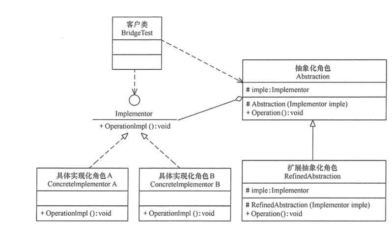  

桥接模式主要包含以下主要角色：
1.抽象化(Abstraction)角色：定义抽象类，并包含一个对实现化对象的引用。
2.扩展抽象化角色(RefinedAbstraction)：是抽象化角色的子类，实现父类中的业务方法，并通过组合关系角色中的业务方法。
3.实现化角色（Implementor）：定义实现化角色的接口，供扩展抽象化角色调用。
4.具体实现化（Concrete Implementor）角色：给出实现化接口的具体实现。

3.实现
RemoteControl 表示遥控器，指代 Abstraction。TV 表示电视，指代 Implementor。桥接模式将遥控器和电视分离开来，从而可以独立改变遥控器或者电视的实现。
```java
public abstract class TV {
    public abstract void on();

    public abstract void off();

    public abstract void tuneChannel();
}
public class Sony extends TV {
    @Override
    public void on() {
        System.out.println("Sony.on()");
    }

    @Override
    public void off() {
        System.out.println("Sony.off()");
    }

    @Override
    public void tuneChannel() {
        System.out.println("Sony.tuneChannel()");
    }
}
public class RCA extends TV {
    @Override
    public void on() {
        System.out.println("RCA.on()");
    }

    @Override
    public void off() {
        System.out.println("RCA.off()");
    }

    @Override
    public void tuneChannel() {
        System.out.println("RCA.tuneChannel()");
    }
}

```
遥控器抽象类
```java
public abstract class RemoteControl {
    // 需要控制的电视对象
    protected TV tv;

    public RemoteControl(TV tv) {
        this.tv = tv;
    }
	
    // 几个抽象方法
    public abstract void on();
    public abstract void off();
    public abstract void tuneChannel();
}

```
遥控器实现类1
```java
public class ConcreteRemoteControl1 extends RemoteControl {
    public ConcreteRemoteControl1(TV tv) {
        super(tv);
    }

    @Override
    public void on() {
        System.out.println("ConcreteRemoteControl1.on()");
        tv.on();
    }

    @Override
    public void off() {
        System.out.println("ConcreteRemoteControl1.off()");
        tv.off();
    }

    @Override
    public void tuneChannel() {
        System.out.println("ConcreteRemoteControl1.tuneChannel()");
        tv.tuneChannel();
    }
}

```
遥控器实现类2
```java
ublic class ConcreteRemoteControl2 extends RemoteControl {
    public ConcreteRemoteControl2(TV tv) {
        super(tv);
    }

    @Override
    public void on() {
        System.out.println("ConcreteRemoteControl2.on()");
        tv.on();
    }

    @Override
    public void off() {
        System.out.println("ConcreteRemoteControl2.off()");
        tv.off();
    }

    @Override
    public void tuneChannel() {
        System.out.println("ConcreteRemoteControl2.tuneChannel()");
        tv.tuneChannel();
    }
}


```
客户端
```java
public class Client {
    public static void main(String[] args) {
        // 遥控器1控制RCA电视
        RemoteControl remoteControl1 = new ConcreteRemoteControl1(new RCA());
        remoteControl1.on();
        remoteControl1.off();
        remoteControl1.tuneChannel();
        // 遥控器2控制Sony电视
        RemoteControl remoteControl2 = new ConcreteRemoteControl2(new Sony());
        remoteControl2.on();
        remoteControl2.off();
        remoteControl2.tuneChannel();
    }
}
ConcreteRemoteControl1.on()
RCA.on()
ConcreteRemoteControl1.off()
RCA.off()
ConcreteRemoteControl1.tuneChannel()
RCA.tuneChannel()
ConcreteRemoteControl2.on()
Sony.on()
ConcreteRemoteControl2.off()
Sony.off()
ConcreteRemoteControl2.tuneChannel()
Sony.tuneChannel()

```

##<span id=Decorator>装饰模式</span>
1.概述
为对象动态添加功能，也叫包装器模式（Wrapper）,装饰模式是一种用于替代继承的技术，无需通过子类增加继承就能拓展对象的新功能；使得对象的关联关系替代继承关系，更加灵活，同时避免类型体系的快速膨胀。

在现实生活中，常常需要对**现有产品增加新的功能或美化其外观**，如房子装修、相片加相框等。在软件开发过程中，有时想用一些现存的组件。这些组件可能只是完成了一些核心功能。但在不改变其结构的情况下，可以动态地扩展其功能。所有这些都可以采用装饰模式来实现。


**优点**：
* 扩展对象功能，比继承灵活们不会导致类个数急剧增加；
* 可以使用不同装饰类即这些装饰列的组合，得到不同的效果
* 装饰器模式完全遵守开闭原则

**缺点**：
* 会产生很多小对象。大量小对象占据内存，增加程序的复杂型。

2.使用场景
开发中使用的场景：

典型应用场景就是：IO 中输入流和输出流的设计；
Swing 包中图形界面构件功能；
Servlet API 中提供了一个 reques t对象的 Decorator 设计模式的默认实现类 HttpServletRequestWrapper，HttpServletRequestWrapper 类，增强了 request 对象的功能；
Struts2中，request，response, session 对象的处理。
java.io.BufferedInputStream(InputStream)
java.io.DataInputStream(InputStream)
java.io.BufferedOutputStream(OutputStream)
java.util.zip.ZipOutputStream(OutputStream)
java.util.Collections#checkedList|Map|Set|SortedSet|SortedMap

3. 类图
装饰模式主要包含以下角色。
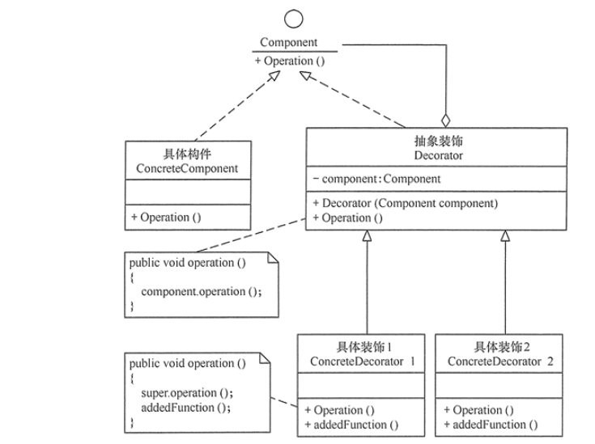  

装饰模式主要包含以下角色。
1.抽象构件（Component）角色：定义一个抽象接口以规范准备接受附加责任的对象。
2.具体构件（ConcreteComponent）角色：实现抽象构件，通过装饰角色为其添加一些职责。
3.抽象装饰（Decorator）角色：继承抽象构件，并包含具体构件的实例，可以通过其子类扩展具体构件的功能
4.具体装饰（ConcreteDecorator）角色：实现抽象装饰的相关方法，并给具体构件对象添加附加的责任。

装饰角色（Decorator）和具体构件（ConcreteComponent）都继承自抽象构件（Component）,具体构件的方法实现不需要依赖于其他对象，而装饰者组合了一个构件，这样可以装饰其他装饰者或者具体构件。

所谓装饰，就是把这个装饰者套在被装饰者之上，从而动态扩展被装饰者的功能。装饰者的方法有一部分是自己的，这属于它的功能，然后调用被装饰者的方法实现，从而也保留了被装饰者的功能。可以看到，具体组件应当是装饰层次的最低层，因为只有具体组件的方法实现不需要依赖于其它对象。

4.实现
设计不同种类的饮料，饮料可以添加配料，比如可以添加牛奶，并且支持动态添加新配料。

每增加一种配料，该饮料的价格就会增加，要求计算一种饮料的价格。

>开闭原则

类应该对扩展开放，对修改关闭：也就是添加新功能时不需要修改代码。饮料可以动态添加新的配料，而不需要去修改饮料的代码。

不可能把所有的类设计成都满足这一原则，应当把该原则应用于最有可能发生改变的地方。

下图表示在 **DarkRoast 饮料**上新增新添加 **Mocha 配料**，之后又添加了 **Whip 配料**。DarkRoast 被 Mocha 包裹，Mocha 又被 Whip 包裹。它们都继承自相同父类，都有 cost() 方法，外层类的 cost() 方法调用了内层类的 cost() 方法。
饮料接口（抽象构件）
```java
public interface Beverage {
    double cost();
}
```
具体饮料1（具体构件）
```java
public class DarkRoast implements Beverage {
    @Override
    public double cost() {
        return 1;
    }
}
```
具体饮料2(具体构件)
```java
public class HouseBlend implements Beverage {
    @Override
    public double cost() {
        return 1;
    }
}
```
调味品装饰器类（抽象装饰）
```java
public abstract class CondimentDecorator implements Beverage {
    // 传入需装饰的饮料类
    protected Beverage beverage;
}
```
配料类-牛奶（具体装饰）
```java
public class Milk extends CondimentDecorator {

    public Milk(Beverage beverage) {
        this.beverage = beverage;
    }

    @Override
    public double cost() {
        return 1 + beverage.cost();
    }
}
```
配料类-抹茶（具体装饰）
```java
public class Mocha extends CondimentDecorator {

    public Mocha(Beverage beverage) {
        this.beverage = beverage;
    }

    @Override
    public double cost() {
        return 1 + beverage.cost();
    }
}
```
实现
```java
public class Client {

    public static void main(String[] args) {
        // 点了一杯HouseBlend
        Beverage beverage = new HouseBlend();
        // 在HouseBlend外面包装上抹茶和牛奶 每包装一层增加一次价格
        beverage = new Mocha(beverage);
        beverage = new Milk(beverage);
        // 计算总的价格
        System.out.println(beverage.cost());
    }
}
```

5.拓展
>装饰模式和桥接模式的区别

两个模式都是为了解决过多子类对象问题。但他们的诱因不一样。桥模式是对象自身现有机制沿着多个维度变化，是既有部分不稳定。装饰模式是为了增加新的功能。


##<span id=Facade>外观模式</span>
1.概述
在现实生活中，常常存在办事较复杂的例子，如办房产证或注册一家公司，有时要同多个部门联系，这时要是有一个综合部门能解决一切手续问题就好了。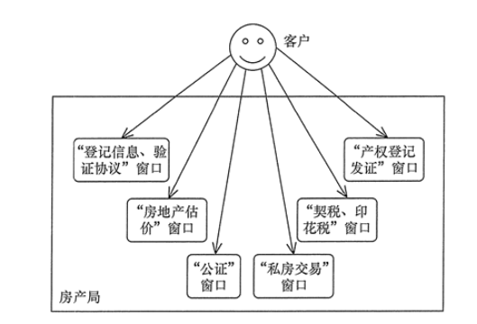  


软件设计也是这样，当一个系统的功能越来越强，子系统会越来越多，客户对系统的访问也变得越来越复杂。这时如果系统内部发生改变，客户端也要跟着改变，这违背了“开闭原则”，也违背了“迪米特法则”，所以有必要为多个子系统提供一个统一的接口，从而降低系统的耦合度，这就是外观模式的目标。

外观（Facade）模式是“迪米特法则”的经典应用，它有以下主要优点。
1.降低了子系统与客户端之间的耦合度，使得子系统的变化不会影响调用它的客户类。
2.对客户屏蔽了子系统组件，减少了客户处理的对象数目，并使得子系统使用起来更加容易
3.降低了大型软件系统中的编译依赖性，简化了系统在不同平台之间的移植过程，因为编译一个子系统不会影响其他的子系统，也不会影响外观。


外观（Facade）模式的主要缺点如下。
不能很好地限制客户使用子系统类，很容易带来未知风险。
增加新的子系统可能需要修改外观类或客户端的源代码，违背了“开闭原则”。


2.使用场景
**开放中常用的场景**：应用频率很高。哪里都会遇到。各种技术和框架中，都有外观模式的使用。如：
* Hibernate 提供的工具类。
* Spring JDBC 工具类等。

3.类图
简单来说，就是将一些复杂的流程封装成一个接口供给外部用户更简单的使用。
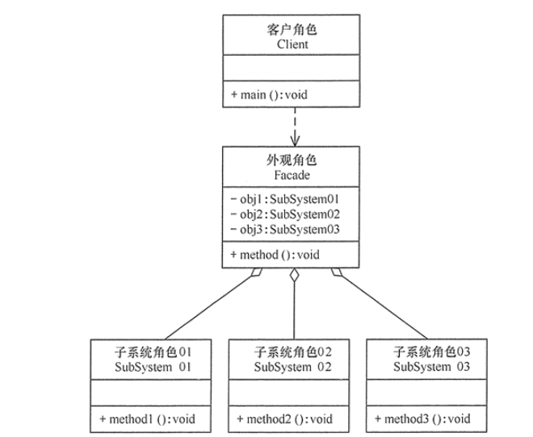  
* 外观（Facade）角色：为多个子系统对外提供一个共同的接口。
* 子系统（Sub System）角色：实现系统的部分功能，客户可以通过外观角色访问它。
* 客户（Client）角色：通过一个外观角色访问各个子系统的功能。

4.实现
子系统
```java
//子系统角色
class SubSystem01 {
    public void method1() {
        System.out.println("子系统01的method1()被调用！");
    }
}
//子系统角色
class SubSystem02 {
    public void method2() {
        System.out.println("子系统02的method2()被调用！");
    }
}
//子系统角色
class SubSystem03 {
    public void method3() {
        System.out.println("子系统03的method3()被调用！");
    }
}
```
外观角色
```java
class Facade {
    private SubSystem01 obj1 = new SubSystem01();
    private SubSystem02 obj2 = new SubSystem02();
    private SubSystem03 obj3 = new SubSystem03();
    public void method() {
        obj1.method1();
        obj2.method2();
        obj3.method3();
    }
}
```
客户角色
```java
public class FacadePattern {
    public static void main(String[] args) {
        Facade f = new Facade();
        f.method();
    }
}

```

##<span id=Flyweight>享元模式</span>
1.概述
利用**共享**的方式来支持**大量细粒度**的对象，这些对象一部分**内部状态是相同**的。

例如，围棋和五子棋中的黑白棋子，图像中的坐标点或颜色，局域网中的路由器、交换机和集线器，教室里的桌子和凳子等。这些对象有很多相似的地方，如果能把它们**相同的部分提取出来共享**，则能节省大量的系统资源，这就是享元模式的产生背景。

==享元模式核心==：

* 享元模式以共享的方式高效地支持大量细粒度对象的重用。
* 利用**缓存**来加速**大量小对象**的访问时间。
* 享元对象能做到共享的关键是**区分**了内部状态和外部状态。
   • 内部状态：可以共享，不会随环境变化而改变 
   • 外部状态：不可以共享，**会随环境变化而改变**

享元模式的优缺点： 
优点
* 极大减少内存中对象的**数量**
* 相同或相似对象内存中**只存一份**，极大的节约资源，提高系统性能
* 外部状态相对独立，不影响内部状态

缺点
* 模式较复杂，使程序逻辑复杂化
* 为了节省内存，共享了内部状态，分离出外部状态，而读取外部状态使运行时间变长。用**时间换取了空间**。

2.使用场景
享元模式由于其共享的特性，可以在 ==任何“池”== 中操作，比如：线程池、数据库连接池、Integer 缓存池。
String 类的设计也是享元模式。
Java 利用缓存来加速大量小对象的访问时间。自动装箱和拆箱操作。
java.lang.Integer#valueOf(int)
java.lang.Boolean#valueOf(boolean)
java.lang.Byte#valueOf(byte)
java.lang.Character#valueOf(char)


3.类图
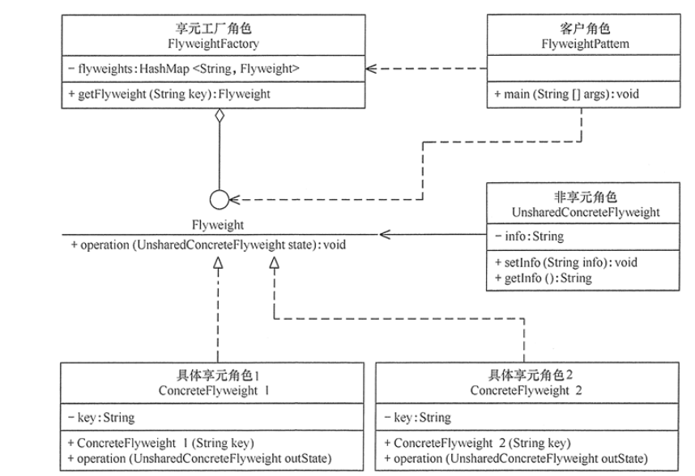  

* UnsharedConcreteFlyweight 是非享元角色，里面包含了非共享的外部状态信息 info;
* Flyweight 是抽象享元角色，里面包含了享元方法 operation（UnsharedConcreteFlyweight state）,非享元的外部状态以参数的形式通过该方法传入；
* ConcreteFlyweight是享元工厂角色，它是关键字key来管理具体享元
* 客户角色通过享元工厂获取具体享元，并访问具体享元的相关方法。
  

4.实现
比如围棋软件设计，每个围棋棋子都是一个对象，有如下属性：颜色、形状、大小(这些是可以共享的)。称之为：内部状态。而围棋的位置(这些不可以共享)称之为：外部状态。该过程可分为以下 5 步：

步骤1：定义**抽象享元接口**
```java
/**
 * 享元类
 */
public interface ChessFlyWeight {
    // 颜色
	void setColor(String c);
	String getColor();
    // 展示
	void display(Coordinate c);
}
```

步骤2：定义**具体享元类**
```java
/**
 * 具体享元类
 */
class ConcreteChess implements ChessFlyWeight {

	private String color;
	
	public ConcreteChess(String color) {
		super();
		this.color = color;
	}

	@Override
	public void display(Coordinate c) {
		System.out.println("棋子颜色：" + color);
		System.out.println("棋子位置：" + c.getX() + "----" + c.getY());
	}

	@Override
	public String getColor() {
		return color;
	}

	@Override
	public void setColor(String c) {
		this.color = c;
	}
}
```
步骤3：定义**非共享享元类**，棋子坐标。即为**外部状态**，状态不同。
```java
/**
 * 外部状态 UnSharedConcreteFlyWeight
 */
public class Coordinate {
	private int x, y;

	public Coordinate(int x, int y) {
		super();
		this.x = x;
		this.y = y;
	}

	public int getX() {
		return x;
	}
	public void setX(int x) {
		this.x = x;
	}
	public int getY() {
		return y;
	}
	public void setY(int y) {
		this.y = y;
	}
}

```
步骤4：定义享元工厂类
```java
/**
 * 享元工厂类
 */
public class ChessFlyWeightFactory {
	// 享元池
	private static Map<String,ChessFlyWeight> map = new HashMap<String, ChessFlyWeight>();
	// 获取一个颜色的棋子
	public static ChessFlyWeight getChess(String color){
		if(map.get(color) != null){
			return map.get(color);
		}else{
            // 没有这个元则生成后放入池中
			ChessFlyWeight cfw = new ConcreteChess(color);
			map.put(color, cfw);
			return cfw;
		}
	}
}

```
步骤5：测试
```java
public class Client {
	public static void main(String[] args) {
        // 首先池中没有黑色棋子，创建黑色棋子放入池中
		ChessFlyWeight chess1 = ChessFlyWeightFactory.getChess("黑色");
        // 池中已经有黑色棋子，直接从池中获取
		ChessFlyWeight chess2 = ChessFlyWeightFactory.getChess("黑色");
        // 这两个棋子是同一个对象
		System.out.println(chess1);
		System.out.println(chess2);
		
		System.out.println("增加外部状态的处理===========");
		chess1.display(new Coordinate(10, 10));
		chess2.display(new Coordinate(20, 20));
	}
}

// 地址相同 说明是同一个对象
com.nano.designpattern.flyweight.ConcreteChess@5b464ce8
com.nano.designpattern.flyweight.ConcreteChess@5b464ce8
增加外部状态的处理===========
棋子颜色：黑色
棋子位置：10----10
棋子颜色：黑色
棋子位置：20----20
```

##<span id=Composite>组合模式</span>
1.概述
存在很多“**部分-整体**”的关系，例如，大学中的部门与学院、总公司中的部门与分公司、学习用品中的书与书包、生活用品中的衣月艮与衣柜以及厨房中的锅碗瓢盆等。在软件开发中也是这样，例如，文件系统中的文件与文件夹、窗体程序中的简单控件与容器控件等。对这些简单对象与复合对象的处理，如果用组合模式来实现会很方便。

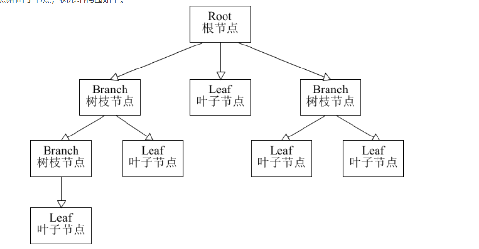  

将对象组合成**树形结构**来表示“**整体-部分**”层次关系，允许用户以**相同的方式处理单独对象和组合对象**。

2.使用场景
**开发中的应用场景**：
操作系统的资源管理器
GUI 中的容器层次图
XML 文件解析
OA 系统中，组织结构的处理
Junit 单元测试框架 : 底层设计就是典型的组合模式，TestCase(叶子)、TestUnite(容器)、Test接口(抽象)
javax.swing.JComponent#add(Component)
java.awt.Container#add(Component)
java.util.Map#putAll(Map)
java.util.List#addAll(Collection)
java.util.Set#addAll(Collection)


3.类图
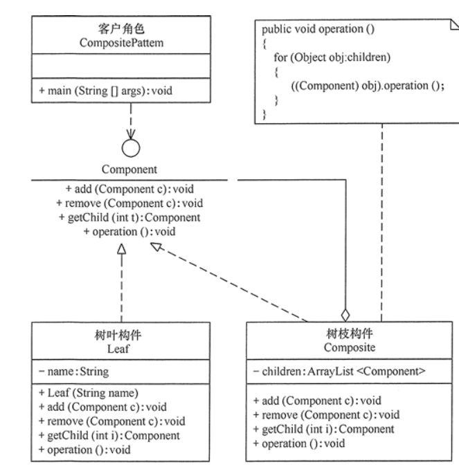  

组合模式包含以下主要角色。
* 抽象构件（Component）角色：它的主要作用是为树叶构件和树枝构件 声明公共接口，并实现它们的默认行为。在透明式的组合模式中抽象构件还声明 访问和管理子类的接口；在安全式的组合模式中不声明访问和管理子类的接口，管理工作由树枝构件完成。（总的抽象类或接口，定义一些通用的方法，比如新增，删除）
* 树叶构件（Leaf）角色：是组合中的叶节点对象，它没有子节点，用于继承或实现抽象构件。
* 树枝构件（Composite）角色：是组合中的叶节点对象，它没有子节点，用于继承或实现抽象构件。


4.实现
抽象构件角色
```java
public abstract class Component {
    protected String name;

    public Component(String name) {
        this.name = name;
    }

    public void print() {
        print(0);
    }

    // 几个抽象方法
    abstract void print(int level);
    abstract public void add(Component component);
    abstract public void remove(Component component);
}

```
树枝构件
```java
public class Composite extends Component {
	// 树枝结点可以存放叶子结点
    private List<Component> child;

    public Composite(String name) {
        super(name);
        child = new ArrayList<>();
    }
	
    // 打印这个组件
    @Override
    void print(int level) {
        for (int i = 0; i < level; i++) {
            System.out.print("--");
        }
        System.out.println("Composite:" + name);
        for (Component component : child) {
            component.print(level + 1);
        }
    }

    @Override
    public void add(Component component) {
        child.add(component);
    }

    @Override
    public void remove(Component component) {
        child.remove(component);
    }
}
```
树叶类
```java
public class Leaf extends Component {
    public Leaf(String name) {
        super(name);
    }

    @Override
    void print(int level) {
        for (int i = 0; i < level; i++) {
            System.out.print("--");
        }
        System.out.println("left:" + name);
    }

    @Override
    public void add(Component component) {
        // 牺牲透明性换取单一职责原则，这样就不用考虑是叶子节点还是组合节点
        throw new UnsupportedOperationException(); 
    }

    @Override
    public void remove(Component component) {
        throw new UnsupportedOperationException();
    }
}
```
Client
```java
public class Client {
    public static void main(String[] args) {
        // 构造根节点
        Composite root = new Composite("root");
        Component node1 = new Leaf("1");
        Component node2 = new Composite("2");
        Component node3 = new Leaf("3");
        root.add(node1);
        root.add(node2);
        root.add(node3);
        Component node21 = new Leaf("21");
        Component node22 = new Composite("22");
        node2.add(node21);
        node2.add(node22);
        Component node221 = new Leaf("221");
        node22.add(node221);
        // 测试打印整个树
        root.print();
    }
}
Composite:root
--left:1
--Composite:2
----left:21
----Composite:22
------left:221
--left:3


```