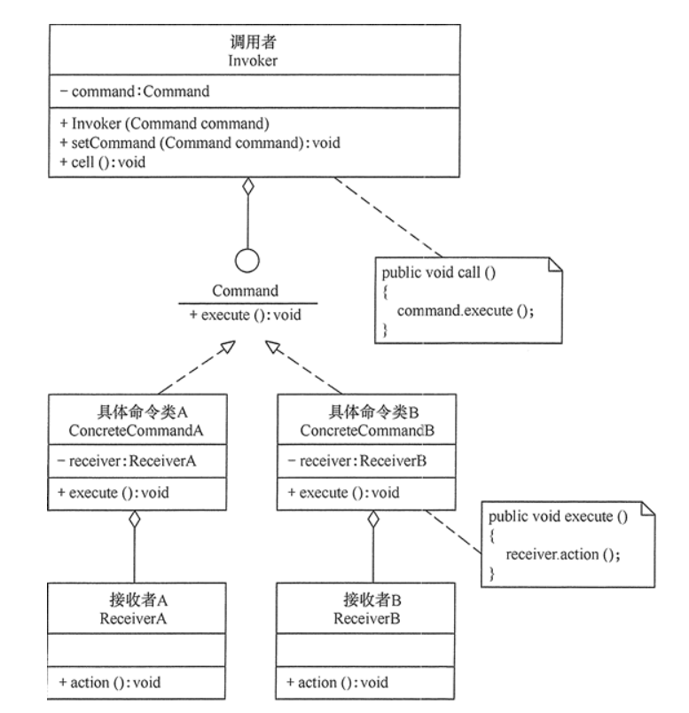

##行为型模式

行为型模式(Behavioral Pattern)是对在不同的对象之间划分责任和算法的抽象化。行为型模式不仅仅关注**类和对象的结构**，而且重点关注它们之间的**相互作用**。通过行为型模式，可以更加清晰地划分类与对象的职责，并研究系统在运行时实例对象之间的交互。在系统运行时，对象并不是孤立的，它们可以通过相互通信与协作完成某些复杂功能，一个对象在运行时也将影响到其他对象的运行。

**行为型模式分为类行为型模式和对象行为型模式两种**：

* **类行为型模式**： 类的行为型模式使用继承关系在几个类之间分配行为，类行为型模式主要通过多态等方式来分配父类与子类的职责。
* **对象行为型模式**： 对象的行为型模式则使用对象的聚合关联关系来分配行为，对象行为型模式主要是通过对象关联等方式来分配两个或多个类的职责。根据“合成复用原则”，系统中要尽量使用关联关系来取代继承关系，因此大部分行为型设计模式都属于对象行为型设计模式。

>行为型模式是GoF设计模式中最为庞大的一类，它包含以下11种模式

* [模板方法（Template  Method）模式](#Tempalte)：定义一个操作中的算法骨架，将算法的一些步骤延迟到子类中，使得子类在可以不改变该算法结构的情况下重定义该算法的某些特定步骤。
* [策略（Strategy）模式](#Strategy)：定义了一系列算法，并将每个算法封装起来，使它们可以相互替换，且算法的改变不会影响使用算法的客户。
* [命令（Command）模式](#Command)：将一个请求封装为一个对象，使发出请求的责任和执行请求的责任分隔开
* [职责链（Chain of Responsibility）模式](#Responsibility)：把请求从链中的一个对象传到下一个对象，直到请求被响应为止。通过这种方式去除对象之间的耦合。
* [状态（State）模式](#State)：允许一个对象在其内部状态发生改变时改变其行为能力。
* [观察者（Observer）模式](#Observer):多个对象间存在一对多关系，当一个对象发生改变时，把这种改变通知其他多个对象，从而影响其他对象的行为。
* [中介者（Mediator）模式](#Mediator)：定义一个中介对象来简化原有对象之间的交互关系，降低系统中对象间的耦合度，使原有对象之间不必相互了解。
* [迭代器（Iterator）模式](#Iterator)：提供一种方法来顺序访问聚合对象中的一系列数据，而不暴露对象的内部表示。
* [访问者（Visitor）模式](#Visitor)：在不改变集合元素的前提下，为一个集合的每个元素提供多种访问方式，即每个元素有多个访问者对象访问。
* [备忘录（Menmento）模式](#Menmento)：在不破坏封装性的前提下，获取并保存一个对象的内部状态，以便以后恢复它。
* [解释器（Interpreter）模式](#Interpreter)：提供如何定义语言的文法，以及对语言句子的解释方法，即解释器。

##<span id=Template>模板方法</span>

1.概述
定义**算法框架**，并将一些步骤的**实现延迟到子类**。通过模板方法，**子类可以重新定义算法的某些步骤**，而**不用改变算法的结构**。

例如，去银行办理业务一般要经过以下4个流程：**取号、排队、办理具体业务、对银行工作人员进行评分**等，其中取号、排队和对银行工作人员进行评分的业务对每个客户是一样的，可以在父类中实现，但是办理具体业务却因人而异，它可能是存款、取款或者转账等，可以延迟到子类中实现。

这样的例子在生活中还有很多，例如，一个人每天会**起床、吃饭、做事、睡觉**等，其中“做事”的内容每天可能不同。我们把这些规定了流程或格式的实例定义成模板，允许使用者根据自己的需求去更新它，例如，简历模板、论文模板、Word 中模板文件等。

**核心**：父类中**定义好处理步骤**，具体实现延迟到**子类实现**。

**什么时候用到模板方法模式**：实现一个算法时，**整体步骤很固定**。但是**某些部分异变**，异变部分可以抽象出来，供子类实现。

2.使用场景
开发中常见的场景：非常频繁，各个框架，类库中都有他的影子。比如：

1.数据库访问的封装。如 Hibernate 中模板程序，Spring 中 JDBCTemplate , HibernateTemplate 等。
2.Junit 单元测试。
3.java.util.Collections#sort()
4.java.io.InputStream#skip()
5.java.io.InputStream#read()
6.java.util.AbstractList#indexOf()

3.类图
  

模板方法模式包含以下角色。
1）抽象类/抽象模板（Abstract Class）
抽象模板类，负责给出一个算法的轮廓和骨架，它由一个模板方法和若干个基本方法构成。这些方法的定义如下。
* **模板方法**：定义了算法的骨架，按某种顺序调用其包含的基本方法。
* **基本方法**：整个算法中的一个步骤，包含以下几种类型。
  * 抽象方法：在**抽象类**中声明，由具体子类实现
  * 具体方法：在抽象类中已经实现，在具体子类中可以继承或重写它。
  * 钩子方法：在抽象类中已经实现，包括用于判断的逻辑方法和需要子类重写的空方法两种。

2）具体子类（ConcreteClass）
  实现抽象类中定义的抽象方法和钩子方法，它们是一个顶级逻辑的一个组成部分。

**冲咖啡**和**冲茶**都有类似的流程，但是某些步骤会有点不一样，要求复用那些相同步骤的代码。如下图有两个方法不同，两个方法相同。

**抽象方法**：prepareRecipe()方法包含整个饮料准备流程，当做模板流程。抽象父类提供了公共方法的实现，对于特殊的业务行为需要由子类实现
```java
public abstract class CaffeineBeverage {
	// 泡茶和冲咖啡都具有的步骤
    final void prepareRecipe() {
        boilWater();
        brew();
        pourInCup();
        addCondiments();
    }
	
    // 子类完成自己的独有的方法
    abstract void brew();
    abstract void addCondiments();

    // 以下两个方法是都有的方法
    void boilWater() {
        System.out.println("烧水");
    }

    void pourInCup() {
        System.out.println("饮料倒入杯中");
    }
}

```
咖啡子类
```java
public class Coffee extends CaffeineBeverage {
    // 覆写第二个特殊的方法
    @Override
    void brew() {
        System.out.println("煮咖啡");
    }

    @Override
    void addCondiments() {
        System.out.println("添加咖啡调味料");
    }
}

```
茶子类
```java
public class Tea extends CaffeineBeverage {
    // 覆写第三个特殊的方法
    @Override
    void brew() {
        System.out.println("煮茶");
    }

    // 覆写第三个特殊的方法
    @Override
    void addCondiments() {
        System.out.println("茶中加入调味料");
    }
}

```
测试
```java
public class Client {
    public static void main(String[] args) {
        CaffeineBeverage caffeineBeverage = new Coffee();
        caffeineBeverage.prepareRecipe();
        System.out.println("-----------");
        caffeineBeverage = new Tea();
        caffeineBeverage.prepareRecipe();
    }
}

烧水
煮咖啡
饮料倒入杯中
添加咖啡调味料
-----------
烧水
煮茶
饮料倒入杯中
茶中加入调味料
```


##<span id=Strategy>策略模式</span>
1.**概述**
定义**一系列算法**，封装**每个算法**，并使它们可以**互换**。策略模式对应于解决某一个问题的**算法族**，允许用户从该算法族中**任选一个算法**解决某一个问题，同时可以方便的更换算法或者增加新的算法。并且由**客户端决定调用哪个算法**。

在现实生活中常常遇到实现某种目标存在多种策略可供选择的情况，例如，出行旅游可以乘坐飞机、乘坐火车、骑自行车或自己开私家车等，超市促销可以釆用打折、送商品、送积分等方法。

在软件开发中也常常遇到类似的情况，当实现某一个功能存在多种算法或者策略，我们可以根据环境或者条件的不同选择不同的算法或者策略来完成该功能，如数据排序策略有冒泡排序、选择排序、插入排序、二叉树排序等。

策略模式的优点：
* 开闭原则，可以在不修改原代码的情况下，灵活增加新算法。
* 可以提供相同行为的不同实现，客户可以根据不同时间或空间要求选择不同的。
* 提供了一系列的可供重用的算法族，恰当使用继承可以把算法族的公共代码转移到父类里面，从而避免重复的代码。
* 多重条件语句不易维护，而使用策略模式可以避免使用多重条件语句，如 if...else 语句、switch...case 语句。

缺点：
其主要缺点如下。
**客户端必须理解所有策略算法的区别，以便适时选择恰当的算法类。**（跟sort那种不一样，那个是客户端不需要了解，自己选择排序算法）
策略模式造成很多的策略类，增加维护难度。

2.**使用场景**
开发中使用的场景：
JAVASE 中 GUI 编程中，布局管理 。
Spring 框架中，Resource 接口，资源访问。
javax.servlet.http.HttpServlet#service()。
如果一个方法有大量 if else 语句，可通过策略模式来消除掉。
一个系统，需要动态地在几个算法中选择一种，可用策略模式实现。
系统有很多类，而他们的区别仅仅在于他们的行为不同。
java.util.Comparator#compare()
javax.servlet.http.HttpServlet
javax.servlet.Filter#doFilter()

3.类图
  
策略模式的主要角色如下。
* 抽象策略（Strategy）类：定义了一个公共接口，各种不同的算法以不同的方式实现这个接口，环境角色使用这个接口调用不同的算法，一般使用接口或抽象类实现。
* 具体策略（Concrete Strategy）类：实现了抽象策略定义的接口，提供具体的算法实现。
* 环境（Context）类：持有一个策略类的引用，最终给客户端调用。

4.实现
比如：去买衣服
新客户小批量：原价，不打折。
新客户大批量：打九折。
老客户小批量：打八五折。
老客户大批量：打 8 折。

可用if else来实现，弊端也很明显，如代码注释中解释，代码参考如下：
```java
/**
 * 实现起来比较容易，符合一般开发人员的思路
 * 假如，类型特别多，算法比较复杂时，整个条件语句的代码就变得很长，难于维护
 * 如果有新增类型，就需要频繁的修改此处的代码！
 * 不符合开闭原则！
 */
public class TestStrategy {
	public double getPrice(String type, double price) {
		if (type.equals("普通客户小批量")) {
			System.out.println("不打折,原价");
			return price;
		} else if (type.equals("普通客户大批量")) {
			System.out.println("打九折");
			return price * 0.9;
		} else if (type.equals("老客户小批量")) {
			System.out.println("打八五折");
			return price * 0.85;
		} else if (type.equals("老客户大批量")) {
			System.out.println("打八折");
			return price * 0.8;
		}
		return price;
	}
}
```

因此可用策略模式来实现买衣服打折的问题：
第一步：定义**抽象策略角色**，通常情况下使用接口或者抽象类来实现，相当于一个算法族
```java  
public interface Strategy {
	public double getPrice(double standardPrice);
}
```
第二步：实现策略接口，实现具体的策略，相当于实现几个不同的算法。
```java
/**
 * 新客户小批量
 */
public class NewCustomerFewStrategy implements Strategy {
	
	@Override
	public double getPrice(double standardPrice) {
		System.out.println("不打折，原价");
		return standardPrice;
	}
}

/**
 * 新客户大批量
 */
public class NewCustomerManyStrategy implements Strategy {

	@Override
	public double getPrice(double standardPrice) {
		System.out.println("打九折");
		return standardPrice*0.9;
	}
}
/**
 * 老客户小批量
 */
public class OldCustomerFewStrategy implements Strategy {

	@Override
	public double getPrice(double standardPrice) {
		System.out.println("打八五折");
		return standardPrice*0.85;
	}
}
/**
 * 老客户大批量
 */
public class OldCustomerManyStrategy implements Strategy {

	@Override
	public double getPrice(double standardPrice) {
		System.out.println("打八折");
		return standardPrice*0.8;
	}
}

```
第三步：**定义环境角色**Context,负责和具体的策略类交互，内部持有一个**策略类的引用**，给客户端调用。
```java
/**
 * 负责和具体的策略类交互
 * 这样的话，具体的算法和直接的客户端调用分离了，使得算法可以独立于客户端独立的变化。
 * 如果使用spring的依赖注入功能，还可以通过配置文件，动态的注入不同策略对象，动态的切换不同的算法.
 */
public class MallContext {
	private Strategy strategy;	//当前采用的算法对象

	//可以通过构造器来注入
	public MallContext(Strategy strategy) {
		super();
		this.strategy = strategy;
	}
	//可以通过set方法来注入
	public void setStrategy(Strategy strategy) {
		this.strategy = strategy;
	}
	
	public void pringPrice(double s){
		System.out.println("您该报价："+strategy.getPrice(s));
	}
}

```
第四步：测试
```java
/**
 * 测试类
 */
public class Client {
	public static void main(String[] args) {
		// 自己选择使用何种策略
		Strategy s1 = new OldCustomerManyStrategy();
        // 根据选择的策略使用不同的算法
		MallContext ctx = new MallContext(s1);
		ctx.pringPrice(500);
	}
}
打八折
您该报价:400.0

```

1. 拓展
策略模式类图与状态模式类图好像啊。

>与状态模式的比较

状态模式的类图和策略模式类似，并且都是能够动态改变对象的行为。但是状态模式是通过状态转移来改变 Context 所组合的 State 对象，而策略模式是通过 Context 本身的决策来改变组合的 Strategy 对象。所谓的状态转移，是指 Context 在运行过程中由于一些条件发生改变而使得 State 对象发生改变，注意必须要是在运行过程中。

状态模式主要是用来解决状态转移的问题，当状态发生转移了，那么 Context 对象就会改变它的行为；而策略模式主要是用来封装一组可以互相替代的算法族，并且可以根据需要动态地去替换 Context 使用的算法。

##<span id=Command>命令模式</span>
1.**概述**
将一个**请求**封装为一个**对象**，从此可以用不同的**请求对客户进行参数化**，对请求**排队**或记录请求**日志**，以及支持可**取消**的操作。将命令封装成**对象**中，具有以下作用：

* 使用**命令来参数化**其它对象
* 将命令放入队列中进行**排队**
* 将命令的操作记录到**日志**中
* 支持**可撤销**的操作

在现实生活中，命令模式的例子也很多。比如看电视时，我们只需要轻轻一按遥控器就能完成频道的切换，这就是命令模式，将换台请求和换台处理完全解耦了。电视机遥控器（命令发送者）通过按钮（具体命令）来遥控电视机（命令接收者）。

命令模式的主要优点如下：
* 通过引入中间件（抽象接口）降低系统的耦合度。
* 扩展性良好，增加或删除命令非常方便。采用命令模式增加与删除命令不会影响其他类，且满足“开闭原则”。
* 可以实现宏命令。命令模式可以与组合模式结合，将多个命令装配成一个组合命令，即宏命令。
* 方便实现 Undo 和 Redo 操作。命令模式可以与后面介绍的备忘录模式结合，实现命令的撤销与恢复。
* 可以在现有命令的基础上，增加额外功能。比如日志记录，结合装饰器模式会更加灵活。

缺点：
1） 可能产生大量具体的命令类。因为每一个具体操作都需要设计一个具体命令类，这会增加系统的复杂性。
2） 命令模式的结果其实就是接收方的执行结果，但是为了以命令的形式进行架构、解耦请求与实现，引入了额外类型结构（引入了请求方与抽象命令接口），增加了理解上的困难。不过这也是设计模式的通病，抽象必然会额外增加类的数量，代码抽离肯定比代码聚合更加难理解。

2.使用场景
何时使用：在某些场合，比如要对行为进行"==记录、撤销/重做、事务=="等处理，这种无法抵御变化的紧耦合是不合适的。在这种情况下，如何将"行为请求者"与"行为实现者"解耦？将一组行为抽象为对象，可以实现二者之间的松耦合。

主要解决：在软件系统中，行为请求者与行为实现者通常是一种紧耦合的关系，但某些场合，比如需要对行为进行记录、撤销或重做、事务等处理时，这种无法抵御变化的紧耦合的设计就不太合适。

开发中常见的场景：
* Struts2中，action 的整个调用过程中就有命令模式。Struts 其实就是一种将请求和呈现分离的技术，其中必然涉及命令模式的思想。比如 : struts 1 中的 action 核心控制器 ActionServlet 只有一个，相当于 Invoker，而模型层的类会随着不同的应用有不同的模型类，相当于具体的 Command。

* 数据库事务机制的底层实现。

* 命令的撤销和恢复。

* java.lang.Runnable

* Netflix Hystrix

* javax.swing.Action

3.类图
  
命令模式的结构：
命令模式包含以下主要角色：
* 抽象命令类（Command）角色：声明执行命令的接口，拥有执行命令的抽象方法execute()。
* 具体命令类（Concrete Command）角色：是抽象命令类的具体实现类，它拥有接受者对象，并通过调用接受者的功能来完成命令要执行的操作。
* 实现者/接收者（Receiver）角色：执行命令功能的相关操作，是具体命令对象业务的真正实现者。
* 调用者/请求者（Invoker）角色：是请求的发送者，它通常拥有很多的命令对象，并通过访问命令对象来执行相关请求，它不直接访问接收者。

4.实现
设计一个遥控器，可以控制电灯开关。
灯类。
```java
public class Light {
    
    public void on() {
        System.out.println("Light is on!");
    }

    public void off() {
        System.out.println("Light is off!");
    }
}
```
定义命令统一Command接口
```java
public interface Command {
    void execute();
}
```
Command 命令接口**实现类**，实现开灯的命令。
```java
public class LightOnCommand implements Command {
    Light light;

    public LightOnCommand(Light light) {
        this.light = light;
    }

    @Override
    public void execute() {
        light.on();
    }
}
```

Command 命令接口实现类，实现关灯的命令。
```java
public class LightOffCommand implements Command {
    Light light;

    public LightOffCommand(Light light) {
        this.light = light;
    }

    @Override
    public void execute() {
        light.off();
    }
}
```
命令的请求者，类似**遥控器**控制灯的功能。
```java
/**
 * 调用者
 */
public class Invoker {
    // 开灯命令
    private Command[] onCommands;
    // 关灯命令
    private Command[] offCommands;
    private final int slotNum = 7;

    public Invoker() {
        this.onCommands = new Command[slotNum];
        this.offCommands = new Command[slotNum];
    }

    public void setOnCommand(Command command, int slot) {
        onCommands[slot] = command;
    }

    public void setOffCommand(Command command, int slot) {
        offCommands[slot] = command;
    }

    // 调用执行命令
    public void onButtonWasPushed(int slot) {
        onCommands[slot].execute();
    }

    public void offButtonWasPushed(int slot) {
        offCommands[slot].execute();
    }
}
```
客户端
```java
public class Client {
    public static void main(String[] args) {
        // 遥控器
        Invoker invoker = new Invoker();
        // 灯
        Light light = new Light();
        // 开关灯命令
        Command lightOnCommand = new LightOnCommand(light);
        Command lightOffCommand = new LightOffCommand(light);
		// 将命令与遥控器一一对应
        invoker.setOnCommand(lightOnCommand, 0);
        invoker.setOffCommand(lightOffCommand, 0);
        // 开灯
        invoker.onButtonWasPushed(0);
        // 关灯
        invoker.offButtonWasPushed(0);
    }
}
```

输出

Light is on!
Light is off!


##<span id=Responsibility>职责链模式</span>
1.概述

使**多个对象都有机会处理请求**，从而避免请求的发送者和接收者之间的耦合关系。将这些对象连成**一条链**，并沿着**这条链**发送该请求，**直到有一个对象处理它为止**。

由于责任链的**创建**完全在**客户端**，因此新增新的具体处理者对原有类库没有任何影响，只需添加新的类，然后在客户端调用时添加即可。符合开闭原则。

责任链模式是一种对象行为型模式，其主要优点如下。
* 降低了对象之间的耦合度。该模式使得一个对象无须知道到底是哪一个对象处理其请求以及链的结构，发送者和接收者也无须拥有对方的明确信息。
*增强了系统的可扩展性。可以根据需要增加新的请求处理类，满足开闭原则。
* 增强了给对象指派职责的灵活性。当工作流程发生变化，可以动态地改变链内的成员或者调动它们的次序，也可动态地新增或者删除责任。
* 责任链简化了对象之间的连接。每个对象只需保持一个指向其后继者的引用，不需保持其他所有处理者的引用，这避免了使用众多的 if 或者 if···else 语句。
* 责任分担。每个类只需要处理自己该处理的工作，不该处理的传递给下一个对象完成，明确各类的责任范围，符合类的单一职责原则。

其主要缺点如下。
* 不能保证每个请求一定被处理。由于一个请求没有明确的接收者，所以不能保证它一定会被处理，该请求可能一直传到链的末端都得不到处理。
* 对比较长的职责链，请求的处理可能涉及多个处理对象，系统性能将受到一定影响。
* 职责链建立的合理性要靠客户端来保证，增加了客户端的复杂性，可能会由于职责链的错误设置而导致系统出错，如可能会造成循环调用。

2.**使用场景**

（1）现实中的场景
在现实生活中，一个事件需要经过多个对象处理是很常见的场景。例如，采购审批流程、请假流程等。公司员工请假，可批假的领导有部门负责人、副总经理、总经理等，但每个领导能批准的天数不同，员工必须根据需要请假的天数去找不同的领导签名，也就是说员工必须记住每个领导的姓名、电话和地址等信息，这无疑增加了难度。

（2）开发中的场景
* Java 中，异常机制就是一种责任链模式。一个 try 可以对应多个 catch，当第一个 catch 不匹配类型，则自动跳到第二个 catch；
* Javascript 语言中，事件的冒泡和捕获机制。Java 语言中，事件的处理采用观察者模式；
* Servlet 开发中，过滤器的链式处理；
* Struts2 中，拦截器的调用也是典型的责任链模式。
* Netty 中的各种 Handler。
* Spring MVC 中的 Interceptor 拦截器。

3.类图
职责链模式主要包含以下角色。
  
职责链模式主要包含以下角色：
1.抽象处理者（Handler）角色：定义一个处理请求的接口，包含**抽象处理方法和一个后继连接**。
2.具体处理者（Concrete Handler）角色：实现抽象处理者的处理方法，判断能否处理本次请求，如果可以处理请求则处理，否则将该请求转给它的后继者。
3.客户类（Client）角色：创建处理链，并向链头的具体处理者对象提交请求，它不关心处理细节和请求的传递过程。

4.实现


定义抽象处理器类 Handler：
```java
abstract class Handler {
    private Handler next;
    public void setNext(Handler next) {
        this.next = next;
    }
    public Handler getNext() {
        return next;
    }
    //处理请求的方法
    public abstract void handleRequest(String request);
}
```
具体处理器实现类 1，如果当前处理器复合该请求的类型，就直接处理，否则交给下一个处理器。
 ```java
class ConcreteHandler1 extends Handler {
    public void handleRequest(String request) {
        if (request.equals("one")) {
            System.out.println("具体处理者1负责处理该请求！");
        } else {
            if (getNext() != null) {
                getNext().handleRequest(request);
            } else {
                System.out.println("没有人处理该请求！");
            }
        }
    }
}
 ```
具体处理器实现类 2：
```java
class ConcreteHandler2 extends Handler {
    public void handleRequest(String request) {
        if (request.equals("two")) {
            System.out.println("具体处理者2负责处理该请求！");
        } else {
            if (getNext() != null) {
                getNext().handleRequest(request);
            } else {
                System.out.println("没有人处理该请求！");
            }
        }
    }
}
```
客户端类：
```java
public class ChainOfResponsibilityPattern {
    public static void main(String[] args) {
        //组装责任链
        Handler handler1 = new ConcreteHandler1();
        Handler handler2 = new ConcreteHandler2();
        handler1.setNext(handler2);
        //提交请求
        handler1.handleRequest("two");
    }
}
```
运行结果:
>具体处理者2负责处理该请求！
##<span id=State>状态模式</span>
1.概述
在软件开发过程中，应用程序中的部分对象可能会根据**不同的情况**做出不同的行为，我们把这种对象称为有状态的对象，而把影响对象行为的一个或多个动态变化的属性称为状态。当有状态的对象与外部事件产生互动时，其内部状态就会发生改变，从而使其行为也发生改变。如人都有高兴和伤心的时候，不同的情绪有不同的行为，当然外界也会影响其情绪变化。

状态模式的解决思想是：当控制一个对象状态转换的条件表达式过于复杂时，把相关“判断逻辑”提取出来，用各个不同的类进行表示，系统处于哪种情况，直接使用相应的状态类对象进行处理，这样能把原来复杂的逻辑判断简单化，消除了 if-else、switch-case 等冗余语句，代码更有层次性，并且具备良好的扩展力。

2.使用场景
1. 银行系统中账号状态的管理。
2. OA系统中公文状态的管理。
3. 酒店系统中，房间状态的管理
4. 线程对象各状态之间的切换。

3.类图
  
状态模式主要包含以下主要角色。
1.环境类（Context）角色：也称为上下文，它定义了客户端需要的接口，内部维护一个当前状态，并负责具体状态的切换。
2.抽象状态（State）角色：定义一个接口，用以封装环境对象中的特定状态所对应的行为，可以有一个或多个行为。
3.具体状态（Concrete State）角色：实现抽象状态所对应的行为，并且在需要的情况下进行状态切换。

4.**实现**
在酒店系统中，房间的状态变化：已预订，已入住，空闲。（当遇到这种需要频繁的修改状态时，考虑状态模式）。该过程用状态模式实现，大致有以下 4 步：
步骤1：定义State抽象状态接口，定义一个接口以封装与Context的一个特定状态的行为。
```java
public interface State {
	void handle();
}
```
步骤2：**定义 Context 环境类**，维护一个 ConcreteState 子类的实例，这个实例**记录当前的状态。**
```java
/**
 * Context类 : 房间对象
 * 如果是银行系统，这个Context类就是账号。根据金额不同，切换不同的状态！
 */
public class HomeContext {
	// 传入状态
	private State state;
    
    // 修改状态
	public void setState(State s){
		System.out.println("修改状态！");
		state = s;
		state.handle();
	}
}
```
步骤3：定义 **ConcreteState 具体状态类**，每一个类封装了一个**状态对应的行为**。
1.已预定状态
```java
/**
 * 已预订状态
 */
public class BookedState implements State {

	@Override
	public void handle() {
		System.out.println("房间已预订！别人不能定！");
	}
}
```
2.已入住状态
```java
/**
 * 已入住状态
 */
public class CheckedInState implements State {

	@Override
	public void handle() {
		System.out.println("房间已入住！请勿打扰！");
	}
}
```
3.空闲状态
```java
/**
 * 空闲状态
 */
public class FreeState implements State {

	@Override
	public void handle() {
		System.out.println("房间空闲！！！没人住！");
	}
}
```
步骤4：客户端测试
```java
public class Client {
	public static void main(String[] args) {
        // 获取环境上下文对象
        HomeContext ctx = new HomeContext();
        // 不断修改状态 产生两种行为
        ctx.setState(new FreeState());
        ctx.setState(new BookedState());
	}
}
修改状态！
房间空闲！！！没人住！
修改状态！
房间已预订！别人不能定！
```


##<span id=Observer>观察者模式</span>
1.概述
在现实世界中，许多对象并不是独立存在的，其中一个对象的行为发生改变可能会导致一个或者多个其他对象的行为也发生改变。例如，某种商品的物价上涨时会导致部分商家高兴，而消费者伤心；还有，当我们开车到交叉路口时，遇到红灯会停，遇到绿灯会行。这样的例子还有很多，例如，股票价格与股民、微信公众号与微信用户、气象局的天气预报与听众、小偷与警察等。

定义对象之间的**一对多**依赖，当一个对象状态改变时，它的所有依赖都会收到通知并且自动更新状态。 主题（Subject）是被观察的对象，而其所有**依赖者**（Observer）称为**观察者**。简单来说，就是 **发布-订阅模式**，**模型-视图模式**（MVC），发布者发布信息，订阅者获取信息，订阅了就能收到信息，没订阅就收不到信息。

观察者模式是一种对象行为型模式，其主要优点如下。
1.降低了目标与观察者之间的耦合关系，两者之间是抽象耦合关系。符合依赖倒置原则。
2.目标与观察者之间建立了一套触发机制。

它的主要缺点如下：
1.目标与观察者之间的依赖关系并没有完全解除，而且有可能出现循环引用。
2.当观察者对象很多时，通知的发布会花费很多时间，影响程序的效率。

跟代理模式对比：观察者模式和代理模式主要区别在它们功能不一样，观察者模式**强调的是被观察者反馈结果**，而代理模式是**负责做同样的事情。**

2.**使用场景**
* 聊天室程序的，服务器转发给所有客户端。
* 京东商城中，群发某商品打折信息。
* Servlet 中，监听器的实现。
* 邮件订阅。
* 网络游戏(多人联机对战)场景中，服务器将客户端的状态进行分发。
* java.util.Observer
* java.util.EventListener
* javax.servlet.http.HttpSessionBindingListener
* RxJava

3.类图
  
观察者模式的主要角色如下：
* 抽象主题（Subject）角色：也叫抽象目标类，它提供了一个用于保存观察者对象的聚集类和增加、删除观察者对象的方法，以及通知所有观察者的抽象方法。
* 具体主题（Concrete Subject）角色：它实现抽象目标中的通知方法，当具体主题的内部状态发生改变时，通知所有注册过的观察者对象。
* 抽象观察者（Observer）角色：它是一个抽象类或接口，它包含了一个更新自己的抽象方法，当接到具体主题的更改通知时被调用。
* 具体观察者（Concrete Observer）角色：实现抽象观察者中定义的抽象方法，以便在得到目标的更改通知时更新自身的状态。

4.**实现**
比如**天气预报系统**会不定时发布一些消息，关注的用户就可以收到推送消息，取消关注就收不到推送消息。

用观察者模式完成该案例，大概有以下五步：
第一，定义**被观察者接口**：也就是一个**抽象主题**，它把所有对观察者对象的引用保存在一个集合中，每个主题都可以有任意数量的观察者。抽象主题提供一个接口，可以增加和删除观察者角色。（也可以用抽象类来实现）
```java
/**
 * 抽象被观察者接口:声明了添加、删除、通知观察者方法
 */
public interface Topic {
	// 注册观察者
    public void registerObserver(Observer o);
    // 移除观察者
    public void removeObserver(Observer o);
    // 通知观察者
    public void notifyObserver();
}

```
第二，定义**观察者接口**：为所有的**具体观察者**定义一个接口，在**得到**主题通知时**更新自己**。
```java
/**
 * 抽象观察者:定义了一个update()方法，当被观察者调用notifyObservers()方法时，
 * 观察者的update()方法会被回调。
 */
public interface Observer {
    // 收到主题时更新消息
    public void update(String message);
}
```
第三，定义具体**被观察者角色**，也就是一个**具体的主题**，在集体主题的内部状态改变时，**向所有登记过的观察者发出通知**。比如下面代码，实现了 Topic 接口，对 Topic 接口的三个方法进行了具体实现，同时有一个 List **集合**，用以保存注册的观察者，等需要通知观察者时，遍历该集合即可。
```java
/**
 * 被观察者，也就是天气服务发布系统
 * 实现了Observerable接口，对Observerable接口的三个方法进行了具体实现
 */
public class WeatherTopic implements Topic {

    // 注意到这个List集合的泛型参数为Observer接口，
    // 设计原则：面向接口编程而不是面向实现编程
    private List<Observer> list;
    private String message;

    public WeatherTopic() {
        list = new ArrayList<>();
    }

    @Override
    public void registerObserver(Observer o) {
        list.add(o);
    }

    @Override
    public void removeObserver(Observer o) {
        if (!list.isEmpty()) {
            list.remove(o);
        }
    }

    @Override
    public void notifyObserver() {
        for (int i = 0; i < list.size(); i++) {
            Observer observer = list.get(i);
            observer.update(message) ;
        }
    }
    // 设置消息
    public void setInfomation(String s) {
        this.message = s;
        System.out.println("天气系统更新消息： " + s);
        //消息更新，通知所有观察者
        notifyObserver();
    }
}
```
第四，**实现观察者接口**：实现抽象观察者角色所需要的**更新接口**，一边使本身的状态与**系统的状态相协调**。
```java
/**
 * 定义具体观察者：实现了update方法
 */
public class WeatherUser implements Observer{
    private String name;
    private String message;

    public WeatherUser(String name) {
        this.name = name;
    }
	
    // 覆写观察者的更新方法，当收到天气更新通知时自己更新状态
    @Override
    public void update(String message) {
        this.message = message;
        read();
    }

    public void read() {
        System.out.println(name + " 收到推送消息： " + message);
    }
}
```
第五，客户端：首先注册了三个用户，zhangsan、lisi、wangwu。公众号发布了一条消息 " 今天有大雨！！！"，三个用户都收到了消息。若用户 zhangsan 不想看到天气预报推送的消息，于是取消订阅了，这时公众号又推送了一条消息 " 明天是晴天~~~"，此时用户 zhangsan 已经收不到消息，其他用户还是正常能收到推送消息。
```java
public class TestObserver {
    public static void main(String[] args) {
        // 定义天气主题
        WeatherTopic weatherTopic = new WeatherTopic();

        // 定义天气三个观察者
        Observer user1 = new WeatherUser("Bob");
        Observer user2 = new WeatherUser("Jack");
        Observer user3 = new WeatherUser("Alice");

        // 观察者注册到主题上
        weatherTopic.registerObserver(user1);
        weatherTopic.registerObserver(user2);
        weatherTopic.registerObserver(user3);

        // 主题发布消息
        weatherTopic.setInfomation("今天有大雨！！！");

        System.out.println("************************************");
        // 将User1取消订阅主题
        weatherTopic.removeObserver(user1);
        // 再次发布消息
        weatherTopic.setInfomation("明天是晴天");
    }
}
天气系统更新消息： 今天有大雨！！！
Bob 收到推送消息： 今天有大雨！！！
Jack 收到推送消息： 今天有大雨！！！
Alice 收到推送消息： 今天有大雨！！！
************************************
天气系统更新消息： 明天是晴天
Jack 收到推送消息： 明天是晴天
Alice 收到推送消息： 明天是晴天

```

##<span id=Mediator>中介者模式</span>
1.**概述**
   
在现实生活中，常常会出现好多对象之间存在复杂的交互关系，这种交互关系常常是“网状结构”，它要求每个对象都必须直到它需要交互的对象。例如，每个人都必须记得他（她）所有朋友的电话，而且，朋友中如果有人的电话修改了，他必须让其他所有的朋友一起修改，这叫做“牵一发而动全身”，非常复杂。

集中相关对象之间复杂的沟通和控制方式。解耦多个==同事对象==之间的交互关系。每个对象都持有中介者对象的引用，只跟中介者对象打交道。我们通过中介者对象统一管理这些交互关系。

如果一个系统中，对象之间的联系呈网状结构，对象之间存在大量的多对多关系，导致关系很复杂。

比如说，一个公司有三个部门：财务部、人事部、销售部。这是可以引入一个==中介者对象==（总经理），各个同事对象只跟中介者对象打交道，将复杂的网络结构化解成为==星型结构==。

2.**使用场景**
开发中常见的场景：
* MVC 模式(其中的 Controller，控制器就是一个中介者对象。Model 和 View 都和它打交道)。
* 窗口游戏程序，窗口软件开发中窗口对象也是一个中介者对象。
* 图形界面开发 GUI 中，多个组件之间的交互，可以通过引入一个中介者对象来解决，可以是整体的窗口对象或者 DOM 对象。
* Java.lang.reflect.Method#invoke()
* All scheduleXXX() methods of java.util.Timer
* java.util.concurrent.Executor#execute()
* submit() and invokeXXX() methods of java.util.concurrent.ExecutorService
* scheduleXXX() methods of java.util.concurrent.ScheduledExecutorService
   
3.类图
  
中介者模式包含以下主要角色。
1.抽象中介者（Mediator）角色：它是中介者的接口，提供了同事对象注册与转发同事对象信息的抽象方法。
2.具体中介者（Concrete Mediator）角色：实现中介者接口，定义一个List来管理同事对象，协调各个同事角色之间的交互关系，因此它依赖于同事角色。
3.抽象同事类（Colleague）角色：定义同事类的接口，保存中介者对象，提供同事对象交互的抽象方法，实现所有相互影响的同事类的公共功能。
4.具体同事类（Concrete Colleague）：是抽象同事类的实现者，当需要与其他同事对象交互时，由中介者对象负责后续的交互。

4.实现
**抽象中介者**
```java
abstract class Mediator {
    public abstract void register(Colleague colleague);
    public abstract void relay(Colleague cl); //转发
}
```
**具体中介者**
```java
class ConcreteMediator extends Mediator {
    private List<Colleague> colleagues = new ArrayList<Colleague>();
    public void register(Colleague colleague) {
        if (!colleagues.contains(colleague)) {
            colleagues.add(colleague);
            colleague.setMedium(this);
        }
    }
    public void relay(Colleague cl) {
        for (Colleague ob : colleagues) {
            if (!ob.equals(cl)) {
                ((Colleague) ob).receive();
            }
        }
    }
}
```
**抽象同事类**
```java
abstract class Colleague {
    protected Mediator mediator;
    public void setMedium(Mediator mediator) {
        this.mediator = mediator;
    }
    public abstract void receive();
    public abstract void send();
}
```
**具体同事类1**
```java
class ConcreteColleague1 extends Colleague {
    public void receive() {
        System.out.println("具体同事类1收到请求。");
    }
    public void send() {
        System.out.println("具体同事类1发出请求。");
        mediator.relay(this); //请中介者转发
    }
}

```
**具体同事类2**
```java
class ConcreteColleague2 extends Colleague {
    public void receive() {
        System.out.println("具体同事类2收到请求。");
    }
    public void send() {
        System.out.println("具体同事类2发出请求。");
        mediator.relay(this); //请中介者转发
    }
}
```
**客户端**
```java
public class MediatorPattern {
    public static void main(String[] args) {
        Mediator md = new ConcreteMediator();
        Colleague c1, c2;
        c1 = new ConcreteColleague1();
        c2 = new ConcreteColleague2();
        md.register(c1);
        md.register(c2);
        c1.send();
        System.out.println("-------------");
        c2.send();
    }
}
```
程序的运行结果如下：
```
具体同事类1发出请求。
具体同事类2收到请求。
-------------
具体同事类2发出请求。
具体同事类1收到请求。
```


##<span id=Iterator>迭代器模式</span>
1.概述
在现实生活以及程序设计中，经常要访问一个聚合对象中的各个元素，如数据结构中的链表遍历，通常的做法是将链表的创建和遍历都放在同一个类中，但这种方式不利于程序的扩展，如果要更换遍历方法就必须修改程序源代码，这违背了 “开闭原则”。

既然将遍历方法封装在聚合类中不可取，那么聚合类中不提供遍历方法，将遍历方法由用户自己实现是否可行呢？答案是同样不可取，因为这种方式会存在两个缺点：

暴露了聚合类的内部表示，使其数据不安全。
增加了客户的负担。

“迭代器模式”能较好地克服以上缺点，它在客户访问类与聚合类之间插入一个迭代器，这分离了聚合对象与其遍历行为，对客户也隐藏了其内部细节，且满足“单一职责原则”和“开闭原则”，如 Java 中的 Collection、List、Set、Map 等都包含了迭代器。

迭代器模式提供了一种顺序访问聚合对象元素的方法，并且不暴露聚合对象的内部表示。

2.使用场景
开发中常见的场景：

JDK 内置的迭代器(List/Set)

3.类图
  

迭代器模式的主要角色：
* 抽象聚合（Aggregate）角色:定义存储、添加、删除聚合对象以及创建迭代器对象的接口。
* 具体聚合（ConcreteAggregate）角色：实现抽象聚合类，返回一个具体迭代器的实例。
* 抽象迭代器（Iterator）角色：定义访问和遍历聚合元素的接口，通常包含hasNext(),fist(),next()等方法。
* 具体迭代器（ConcreteIterator）角色：实现抽象迭代器接口中所定义的方法，完成对聚合对象的遍历，记录遍历的当前位置。
  
4.实现
**抽象聚合**
```java
 interface Aggregate {
    public void add(Object obj);
    public void remove(Object obj);
    public Iterator getIterator();
}
```
**具体聚合**
```java
class ConcreteAggregate implements Aggregate {
    private List<Object> list = new ArrayList<Object>();
    public void add(Object obj) {
        list.add(obj);
    }
    public void remove(Object obj) {
        list.remove(obj);
    }
    public Iterator getIterator() {
        return (new ConcreteIterator(list));
    }
}

```
**抽象迭代器**
```java
interface Iterator {
    Object first();
    Object next();
    boolean hasNext();
}
```
**具体迭代器**
```java
class ConcreteIterator implements Iterator {
    private List<Object> list = null;
    private int index = -1;
    public ConcreteIterator(List<Object> list) {
        this.list = list;
    }
    public boolean hasNext() {
        if (index < list.size() - 1) {
            return true;
        } else {
            return false;
        }
    }
    public Object first() {
        index = 0;
        Object obj = list.get(index);
        ;
        return obj;
    }
    public Object next() {
        Object obj = null;
        if (this.hasNext()) {
            obj = list.get(++index);
        }
        return obj;
    }
}
```
**客户端**
```java
public class Client {

    public static void main(String[] args) {
        Aggregate ag = new ConcreteAggregate();
        ag.add("中山大学");
        ag.add("华南理工");
        ag.add("韶关学院");
        System.out.print("聚合的内容有：");
        Iterator it = ag.getIterator();
        while (it.hasNext()) {
            Object ob = it.next();
            System.out.print(ob.toString() + "\t");
        }
        Object ob = it.first();
        System.out.println("\nFirst：" + ob.toString());
    }
}

```
程序的运行结构如下：
>聚合的内容有：中山大学    华南理工    韶关学院   
First：中山大学


##<span id=Visitor>访问者模式</span>
1.概述
为一个对象结构（比如组合结构）增加新能力。表示一个作用于某对象结构中的各元素的操作。它使你可以在不改变各元素类别的前提下定义作用于这些元素的新操作。

模式动机：对于存储在一个集合中的对象，他们可能具有不同的类型(即使有一个公共的接口)，对于该集合中的对象，可以接受一类称为访问者的对象来访问，不同的访问者其访问方式也有所不同。

例如，公园中存在多个景点，也存在多个游客，不同的游客对同一个景点的评价可能不同；医院医生开的处方单中包含多种药元素，査看它的划价员和药房工作人员对它的处理方式也不同，划价员根据处方单上面的药品名和数量进行划价，药房工作人员根据处方单的内容进行抓药。

2.使用场景
**开发中的场景：**（应用范围较窄，了解即可）
1.XML 文档解析器设计。
2.编译器的设计。
3.复杂集合对象的处理。
4.javax.lang.model.element.Element and javax.lang.model.element.ElementVisitor
5.javax.lang.model.type.TypeMirror and javax.lang.model.type.TypeVisitor

3.类图
  
* 抽象访问者（Visitor）角色:定义一个访问具体元素的接口，为每个具体元素类对应一个访问操作visit(),该操作中的参数类型标识了被访问的具体元素。
* 具体访问者（ConcreteVisitor）角色：实现抽象访问者角色中声明的各个访问操作，确定访问者访问一个元素时该做什么。
* 抽象元素（Element）角色：声明一个包含接收操作accpet()的接口，被接受的访问者对象作为accept()方法的参数。
* 具体元素（ConcreteElement）角色：实现抽象元素角色提供的accept()操作，其方法体通常都是visitor.visit(this),另外具体元素中可能还包含本身业务逻辑的相关操作。
* 对象结构（Object Structure）角色：是一个包含元素角色的容器，提供让访问者对象遍历容器中的所有元素的方法，通常由List，Set,Map等聚合类实现。

4.实现
**抽象元素**
```java
public interface Element {
    void accept(Visitor visitor);
}
```
**具体元素**
```java
public class Customer implements Element {

    private String name;
    private List<Order> orders = new ArrayList<>();

    Customer(String name) {
        this.name = name;
    }

    String getName() {
        return name;
    }

    void addOrder(Order order) {
        orders.add(order);
    }

    public void accept(Visitor visitor) {
        visitor.visit(this);
        for (Order order : orders) {
            order.accept(visitor);
        }
    }
}
```
**顾客组**
```java
class CustomerGroup {
	// 顾客列表
    private List<Customer> customers = new ArrayList<>();

    void accept(Visitor visitor) {
        for (Customer customer : customers) {
            customer.accept(visitor);
        }
    }
	// 添加顾客
    void addCustomer(Customer customer) {
        customers.add(customer);
    }
}


```


**条目**
```java
public class Item implements Element {

    private String name;

    Item(String name) {
        this.name = name;
    }

    String getName() {
        return name;
    }

    public void accept(Visitor visitor) {
        visitor.visit(this);
    }
}

```
**订单**
```java
public class Order implements Element {

    private String name;
    private List<Item> items = new ArrayList();

    Order(String name) {
        this.name = name;
    }

    Order(String name, String itemName) {
        this.name = name;
        this.addItem(new Item(itemName));
    }

    String getName() {
        return name;
    }

    void addItem(Item item) {
        items.add(item);
    }

    public void accept(Visitor visitor) {
        visitor.visit(this);

        for (Item item : items) {
            item.accept(visitor);
        }
    }
}
```
**访问者接口**
```java
public interface Visitor {
    void visit(Customer customer);

    void visit(Order order);

    void visit(Item item);
}
```
**访问者接口实现类**
```java
public class GeneralReport implements Visitor {
	
    private int customersNo;
    private int ordersNo;
    private int itemsNo;

    // 访问某个顾客
    public void visit(Customer customer) {
        System.out.println(customer.getName());
        customersNo++;
    }

    // 访问订单
    public void visit(Order order) {
        System.out.println(order.getName());
        ordersNo++;
    }
	// 访问条目
    public void visit(Item item) {
        System.out.println(item.getName());
        itemsNo++;
    }

    public void displayResults() {
        System.out.println("Number of customers: " + customersNo);
        System.out.println("Number of orders:    " + ordersNo);
        System.out.println("Number of items:     " + itemsNo);
    }
}
```
测试：
```java
public class Client {
    public static void main(String[] args) {
        // 构造用户，订单，条目
        Customer customer1 = new Customer("customer1");
        customer1.addOrder(new Order("order1", "item1"));
        customer1.addOrder(new Order("order2", "item1"));
        customer1.addOrder(new Order("order3", "item1"));
        Order order = new Order("order_a");
        order.addItem(new Item("item_a1"));
        order.addItem(new Item("item_a2"));
        order.addItem(new Item("item_a3"));
        
        Customer customer2 = new Customer("customer2");
        customer2.addOrder(order);
		// 构造用户组
        CustomerGroup customers = new CustomerGroup();
        customers.addCustomer(customer1);
        customers.addCustomer(customer2);
		// 构造访问者
        GeneralReport visitor = new GeneralReport();
        // 接收访问者
        customers.accept(visitor);
        // 展示访问结果
        visitor.displayResults();
    }
}
```
结果：
customer1
order1
item1
order2
item1
order3
item1
customer2
order_a
item_a1
item_a2
item_a3
Number of customers: 2
Number of orders:    4
Number of items:     6


##<span id=Menmento>备忘录模式</span>
1.概述
每个人都有犯错误的时候，都希望有种“后悔药”能弥补自己的过失，让自己重新开始，但现实是残酷的。在计算机应用中，客户同样会常常犯错误，能否提供“后悔药”给他们呢？当然是可以的，而且是有必要的。这个功能由“备忘录模式”来实现。


备忘录模式能记录一个对象的内部状态，当用户后悔时能撤销当前操作，使数据恢复到它**原先的状态**。


2.**使用场景**
开发中常见的应用场景:

* 棋类游戏中的，悔棋。
* 普通软件中的，撤销操作。
* 数据库软件中的，事务管理中的，回滚操作。
* 实现历史记录功能。

3.类图
  

备忘录模式的主要角色如下。
* 发起人（Orignator）角色：记录当前时刻的内部状态信息，提供创建备忘录和恢复备忘录数据的功能，实现其他业务功能，它可以访问备忘录的所有信息。
* 备忘录（Memento）角色：负责存储发起人的内部状态，在需要的时候提供这些内部状态给发起人。
* 管理者（Caretaker）角色：对备忘录进行管理，提供保存与获取备忘录的功能，但其不能对备忘录的内容进行访问和修改

4.实现
步骤1：定义发起人（Originator）类，负责创建一个备忘录 Memento, 用以记录当前时刻它的内部状态，并可使用备忘录恢复内部状态。
```java
public class Emp {
	private String ename;
	private int age;
	private double salary;

	// 进行备忘操作，并返回备忘录对象
	public EmpMemento memento(){
		return new EmpMemento(this);
	}

	// 进行数据恢复，恢复成制定备忘录对象的值
	public void recovery(EmpMemento mmt){
		this.ename = mmt.getEname();
		this.age = mmt.getAge();
		this.salary = mmt.getSalary();
	}

	public Emp(String ename, int age, double salary) {
		super();
		this.ename = ename;
		this.age = age;
		this.salary = salary;
	}	
}
```
步骤2：定义**备忘录类**（Memento）,负责存储Originator对象的**内部状态**,并可防止Originator以外的对象访问备忘录。备忘录的字段与Originator的字段相同。
```java
public class EmpMemento {
    // 属性与Emp相同
	private String ename;
	private int age;
	private double salary;

	public EmpMemento(Emp e) {
		this.ename = e.getEname();
		this.age = e.getAge();
		this.salary = e.getSalary();
	}
	
	//get/set方法
}
```

步骤3：定义负责人（Caretaker）类，负责保存好**备忘录**
```java
/**
 * 负责人类 :负责管理备忘录对象
 */
public class CareTaker {
	// 保存memento对象
	private EmpMemento memento;

    // 可以用集合结构List Map等保存多个Memento对象
	// private List<EmpMemento> list = new ArrayList<EmpMemento>();

	public EmpMemento getMemento() {
		return memento;
	}

	public void setMemento(EmpMemento memento) {
		this.memento = memento;
	}
}
```
步骤4：客户端
```java
public class Client {
    public static void main(String[] args) {
        // 定义Memento管理者对象
        CareTaker taker = new CareTaker();

        Emp emp = new Emp("Jack", 48, 900);
        System.out.println("Init State：" + emp.getEname() + " age：" + emp.getAge() + " salary：" + emp.getSalary());
        // 备忘一次
        taker.setMemento(emp.memento());
        System.out.println("注意：备忘一次");

        // 修改对象状态
        emp.setAge(18);
        emp.setEname("Alice");
        emp.setSalary(9000);
        System.out.println("Changed State：" + emp.getEname() + " age：" + emp.getAge() + " salary：" + emp.getSalary());

        // 恢复到备忘录对象保存的状态
        emp.recovery(taker.getMemento());
        System.out.println("注意：恢复到备忘录对象保存的状态");

        System.out.println("Back To Init State： " + emp.getEname() + " age：" + emp.getAge() + " salary：" + emp.getSalary());
    }
}

```
输出：
```
Init State：Jack age：48 salary：900.0
注意：备忘一次
Changed State：Alice age：18 salary：9000.0
注意：恢复到备忘录对象保存的状态
Back To Init State： Jack age：48 salary：900.0
```


##<span id=Interpreter>解释器模式</span>
1.概述
为**语言**创建**解释器**，通常由**语言的语法和语法分析来定义**。定义一个语言，定义它的**文法**的一种表示，并定义一个解释器，该解释器使用该表示来解释语言中的句子。

* 是一种不常用的设计模式；
* 用于描述如何构成一个简单的语言解释器，主要用于使用面向对象语言开发的编译器和解释器设计；
* 当我们需要开发一种新的语言时，可以考虑使用解释器模式；
* 尽量不要使用解释器模式，后期维护会有很大麻烦。在项目中，可以使用 Jruby，Groovy、java 的 js 引擎来替代解释器的作用，弥补 java 语言的不足。

2.使用场景
开发中场景：
* EL 表达式的处理。
* 正则表达式解释器。
* SQL 语法的解释器。
* 数学表达式解析器，如现成的工具包: Math Expression String Parser、Expression4J 等。

3.类图
  
* 抽象表达式（Abstract Expression）角色：定义解释器的接口，约定解释器的解释操作，主要包含解释方法 interpret()。
* 终结符表达式（Terminal Expression）角色：是抽象表达式的子类，用来实现文法中与终结符相关的操作，文法中的每一个终结符都有一个具体终结表达式与之相对应。
* 非终结符表达式（Nonterminal Expression）角色：也是抽象表达式的子类，用来实现文法中与非终结符相关的操作，文法中的每条规则都对应于一个非终结符表达式。
* 环境（Context）角色：通常包含各个解释器需要的数据或是公共的功能，一般用来传递被所有解释器共享的数据，后面的解释器可以从这里获取这些值。
* 客户端（Client）：主要任务是将需要分析的句子或表达式转换成使用解释器对象描述的抽象语法树，然后调用解释器的解释方法，当然也可以通过环境角色间接访问解释器的解释方法。


4.实现
用解释器模式设计一个“韶粵通”公交车卡的读卡器程序。

说明：假如“韶粵通”公交车读卡器可以判断乘客的身份，如果是“韶关”或者“广州”的“老人” “妇女”“儿童”就可以免费乘车，其他人员乘车一次扣 2 元。

分析：本实例用“解释器模式”设计比较适合，首先设计其文法规则如下。
expression::= city 的 person
city ::= 韶关|广州
person ::= 老人|妇女|儿童
**抽象表达式类**
```java
interface Expression {
    public boolean interpret(String info);
}
```
**终结符表达式**
```java
class TerminalExpression implements Expression {
    private Set<String> set = new HashSet<String>();
    public TerminalExpression(String[] data) {
        for (int i = 0; i < data.length; i++) set.add(data[i]);
    }
    public boolean interpret(String info) {
        if (set.contains(info)) {
            return true;
        }
        return false;
    }
}
```
**非终结符表达式**
```java
class AndExpression implements Expression {
    private Expression city = null;
    private Expression person = null;
    public AndExpression(Expression city, Expression person) {
        this.city = city;
        this.person = person;
    }
    public boolean interpret(String info) {
        String s[] = info.split("的");
        return city.interpret(s[0]) && person.interpret(s[1]);
    }
}
```

**环境类**
```java
class Context {
    private String[] citys = {"韶关", "广州"};
    private String[] persons = {"老人", "妇女", "儿童"};
    private Expression cityPerson;
    public Context() {
        Expression city = new TerminalExpression(citys);
        Expression person = new TerminalExpression(persons);
        cityPerson = new AndExpression(city, person);
    }
    public void freeRide(String info) {
        boolean ok = cityPerson.interpret(info);
        if (ok) System.out.println("您是" + info + "，您本次乘车免费！");
        else System.out.println(info + "，您不是免费人员，本次乘车扣费2元！");
    }
}
```


