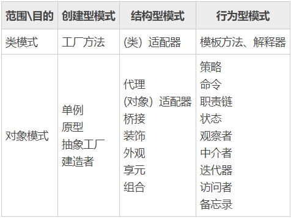

#设计模式概述

面向对象是一种编程思想，包括三大特性和六大原则，其中，三大特性指的是 **封装，继承，多态；**

六大原则指的是“单一职责原则，开闭式原则，迪米特原则，里氏替换原则，依赖倒置原则以及接口隔离原则”。

单一职责原则：类只承担一个原则

开闭原则：对扩展开放，对修改关闭

迪米特原则：一个对象应该对其他对象有最少的了解

里氏替换：子类可以扩展父类的功能，但不能改变员有父类的功能

依赖倒置原则：面向接口编程

接口隔离原则:一个类对另一个类的依赖应该建立在最小的接口上。

设计模式有两种分类方法，即根据模式的目的来分和根据模式的作用的范围来分。

* 根据目的来分
* 创建型模式，结构型模式和行为型模式
  *  创建型模式：用于"怎样创建对象"，将“对象的创建与使用分离”。
  *  结构型模式：用于描述将类或对象按某种布局组成更大的结构。
  *  行为型模式：用于描述类或对象之间怎样相互协作完成单个对象无法单独完成的任务。

23种设计模式的分类。
  
