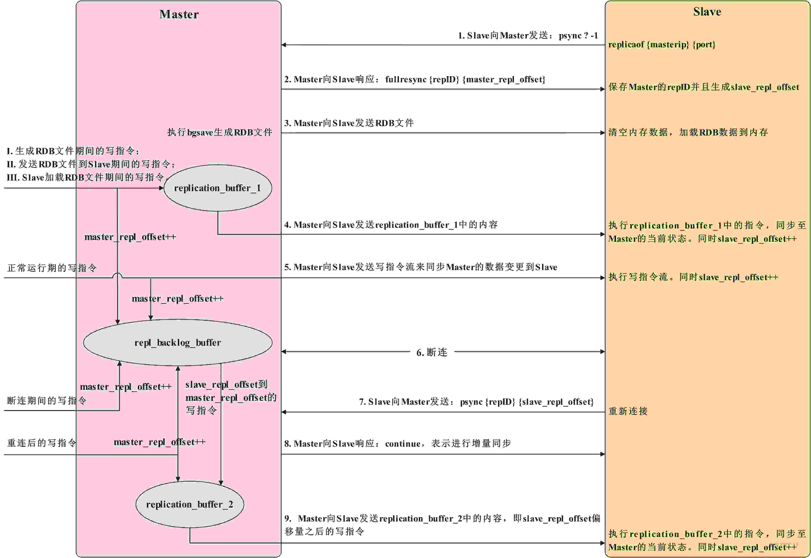
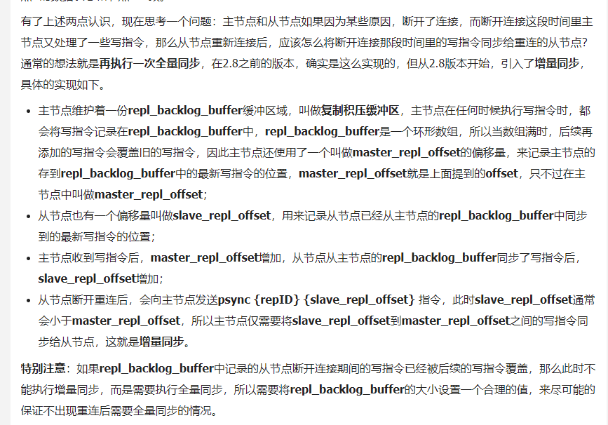

# Redis

## redis集群，哨兵

  * 集群目的是解决单机Redis内存有限和并发问题，哨兵目的是高可用性。
  * 哨兵中每个实例是全量存储，集群是分布式存储，可以最大化利用内存。

Redis主从与集群之间的主要区别体现在架构、数据存储与访问方式以及高可用性机制等方面：

架构与组成：

主从（Master-Slave）模式：通常包含一个主节点和多个从节点。主节点负责处理写请求，而从节点负责处理读请求，并实现数据的备份123。这种模式下，数据主要在主节点上存储，而从节点同步主节点的数据。
集群（Cluster）模式：由多个主从节点组组成，每个主节点可以有多个从节点。集群模式通过分片（sharding）机制将数据分散到不同的节点上，以实现数据的均衡分布和高并发处理。
数据存储与访问：

主从模式：所有数据都在主节点上存储，从节点只是主节点的数据副本。读操作可以在从节点上进行，写操作则必须在主节点上进行23。
集群模式：数据被分散存储在不同的节点上，通过哈希计算决定数据应该存储在哪个节点上。集群模式支持多个主节点同时处理写操作，从而提高了写性能14。
高可用性机制：

主从模式：虽然提供了数据的备份和故障恢复能力（当主节点故障时，可以从从节点中选举一个新的主节点），但通常需要手动介入进行故障转移和主从切换123。
集群模式：集群自身具备自动故障转移和选举新主节点的能力。当某个主节点故障时，集群中的其他节点可以自动发现并选举新的主节点，从而保证了服务的高可用性4。
节点扩容与缩容：

主从模式：通常只能对从节点进行扩容，主节点扩容相对复杂且可能涉及数据迁移等问题4。
集群模式：支持整个主从节点的扩容和缩容。扩容后，需要通过槽位分片来重新分配数据，以实现数据的均衡分布4。
总结来说，Redis主从模式主要关注数据的备份和读写分离读写，适用于对读性能要求较高且数据量适中的场景；而集群模式则更注重数据的分布式存储和负载均衡，适用于需要处理大量数据和高并发请求的场景。在选择使用主从模式还是集群模式时，需要根据具体的业务需求、数据量大小、读写比例以及系统性能要求来进行权衡。

## redis 主从同步
Redis的主从数据是异步同步的，所以分布式的 Redis系统并不满足一致性要求当客户端在 Redis的主节点修改了数据后，立即返回，即使在主从网络断开的情况下主节点依旧可以正常对外提供修改服务，所以 Redis 满足可用性。

Redis中采用读写分离来保证主节点和从节点之间的数据一致性，具体实现如下。

主节点支持数据写入和数据读取，从节点只支持数据读取；
主节点会与从节点之间执行主从数据同步，以保证主节点数据与从节点数据一致。

主从数据同步分为如下几种情况。

从节点与主节点建立连接时进行全量同步；
主节点与从节点正常运行时的同步；
主节点与从节点连接断开后又重连时会进行增量同步或全量同步。

如果缓冲区没有写满，则增量同步，否则就全量同步
## redis 为什么快

1. redis 是基于内存的
2. redis 主流程操作基于单线程，没有额外线程切换的开销
3. redis 设计的数据结构来方便操作，如字符串、列表、哈希、集合和有序集合，这些数据结构都针对内存使用进行了优化，使得数据操作更加快速。此外，Redis还使用了一系列高效的算法和内部实现，如基于epoll的IO多路复用，使得数据操作更加高效
4. 采用多线程的方式来优化io

## redis 数据结构

