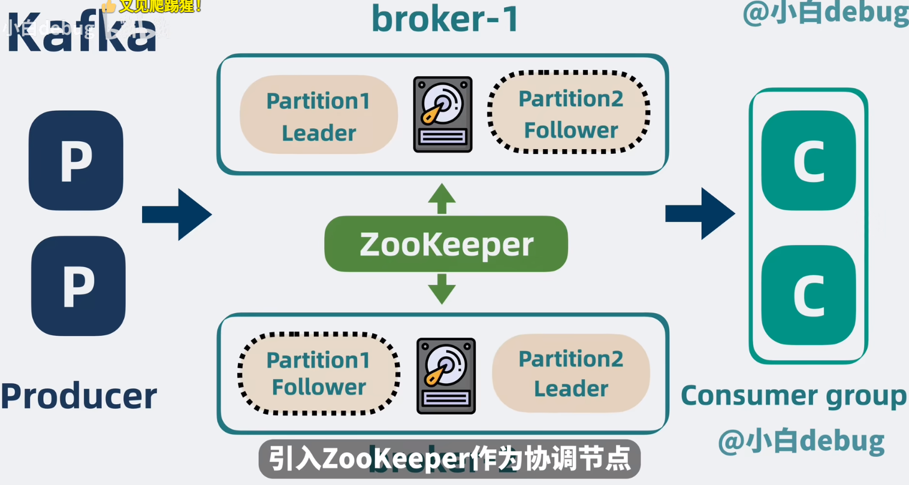
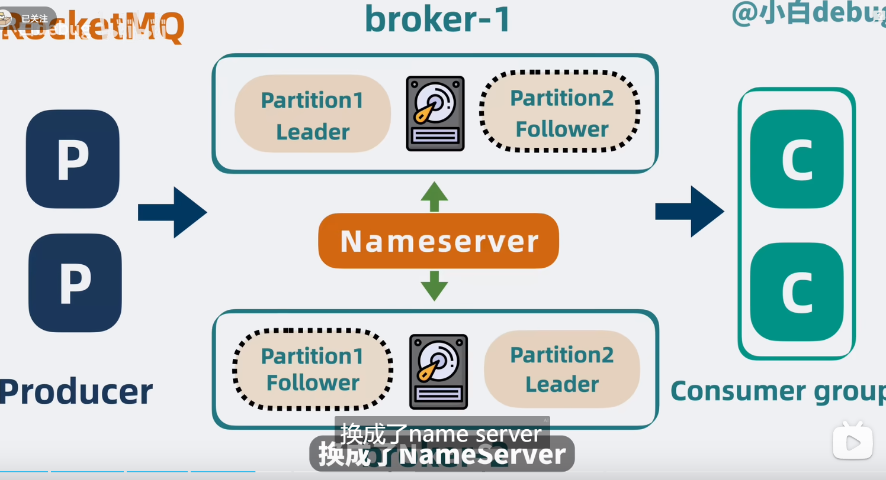
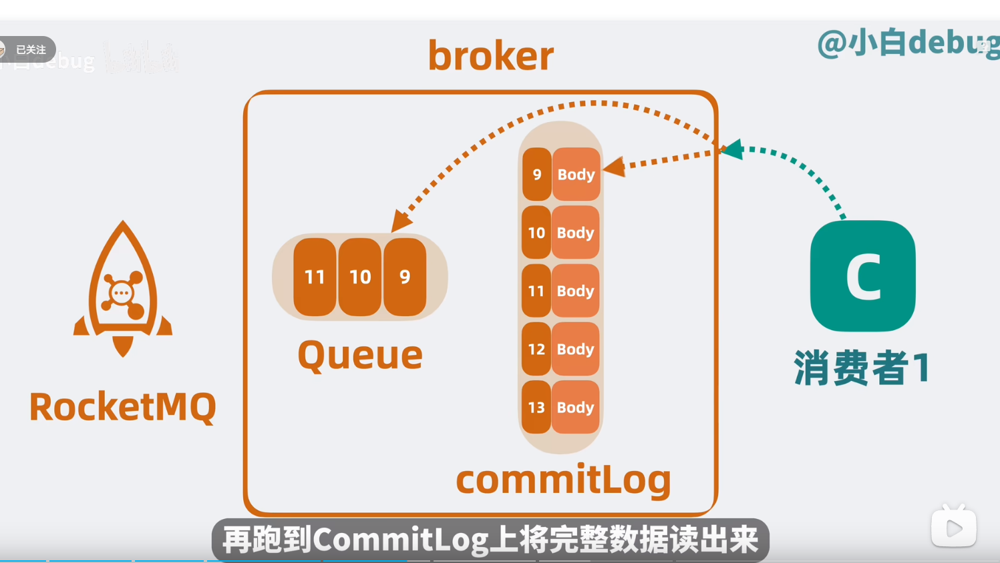

# rocketmq和kafka 的区别

rocketmq 相比于kafka，在架构上做了一些减法，以及功能上做了一些加法

## 架构上

1. kafka 之前用zookeeper作为协调结点，但是目前也改进了用raft算法做协调， 而rocketmq则是用nameserver 做协调

2. kafka 的 partition 存储消息是完整的数据，consumer 只需要取一次就够了，但是rocketmq则是从broker里的queue读出offset，然后再从commit log 取，要取两次。

这主要跟两者的存储模式有关系，
像kafka 它的partition 分区有很多段，即segment，每个segment就相当于小文件，当记录消息时，就相当于在这个小文件里顺序写，问题来了，当kafka的topic 很多时，就相当于同时写多个文件，顺序写会劣化成随机写、写性能就降低了。（这也就是kafka在topic增多时性能比不过rocketmq的原因把）

rocketmq的存储，将单个broker的多个topic数据全部写到一个commitlog上，这就变成了消除了随机写的问题。

同样备份模型，
像kafka对多个partition分布在多个broker之间，那么它们不同broker之间的同步就是同步segment文件，而rocketmq则直接同步commitlog

## 功能上

rocketmq 可支持消息分类，对同个topic下的消息还可以根据tag 进行分类

支持事务，kafka 发送消息，要么三条都成功。要么都失败，rocketmq 

延时队列

死信队列（把失败的消息）

但是rocketmq性能上为什么比不上kafka

Kafka的生产者采可以异步发送消息机制，当发送一条信息时，消息并没有发送到Broker而是缓存起来，然后直接向业务返回成功，当缓存的消息达到一定数量时再批量发送给Broker，这种做法减少了网络io，从而提高了消息发送的吞吐量，但是如果消息生产者宕机，会导致消息消失，业务出错，所以理论上kafka利用此机制提供了性能却降低了可靠性。

# rocketmq 如何保证消息的可靠性

producer:
同步发送消息

broker：
同步刷盘
主从同步

consumer：

