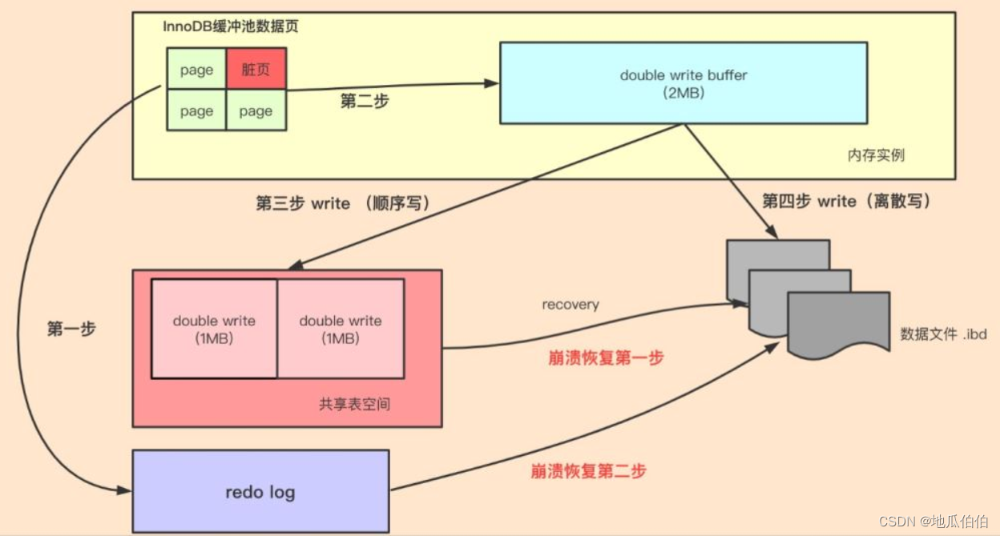
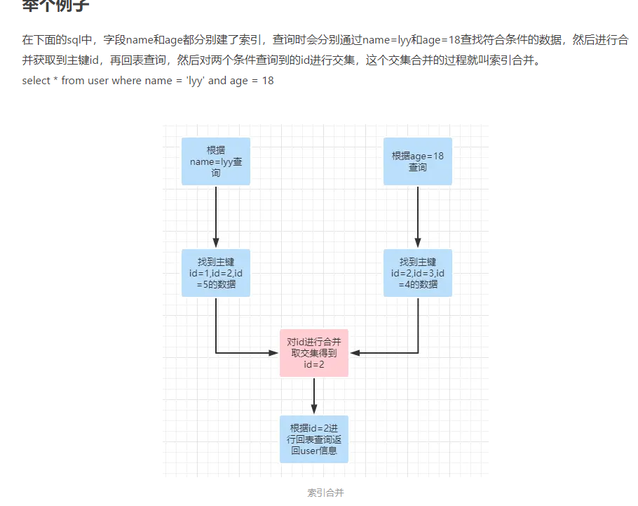

#为什么MyISAM查询性能好？
https://time.geekbang.org/column/article/80495

索引结构：MyISAM使用非聚簇索引，其索引文件中的索引指向数据结构中的表数据。这种结构使得MyISAM的查询能够直接定位到文件的偏移量，从而比InnoDB的聚簇索引查询速度更快1。
缓存机制：MyISAM表使用系统的缓存机制来提高查询性能。它将表数据和索引分别缓存在内存中，从而加快读取操作。这种缓存机制有助于减少磁盘I/O操作，从而提高查询效率2。
并发处理：MyISAM使用表级锁定来处理并发访问。虽然这在一定程度上限制了并发性能，但在读多写少的场景下，它可以保证多个读操作同时进行，从而提高了查询性能2。
需要注意的是，虽然MyISAM在查询性能方面表现良好，但它不支持事务处理和行级锁定，因此在需要高并发写操作或需要数据完整性和一致性的场景中，InnoDB可能是更好的选择3。此外，MyISAM在崩溃时可能会导致数据损坏，恢复数据较为困难，而InnoDB支持崩溃恢复和事务日志，可以更好地保护数据4。

综上所述，MyISAM的查询性能好主要得益于其索引结构、缓存机制和并发处理方式。但在选择存储引擎时，还需要根据具体的应用场景和需求进行权衡。

# 如何用过sql实现乐观锁与悲观锁

乐观锁
update table
set value = xx,
version = verson +1
where
id = #{id}
version = #{version}

如何打破双亲委派机制
https://zhuanlan.zhihu.com/p/423436230

通过重写LoaderClass类的loadClass方法，来重写类加载器

#  Doublewrite Buffer（双写缓冲区）机制

双写缓冲区是为了解决因页写损坏导致的数据不一致问题。当InnoDB要将一个数据页写入磁盘时，它首先将该页的一个副本写入双写缓冲区，然后再写入其实际位置。如果在写入实际位置的过程中发生了崩溃，InnoDB可以从双写缓冲区中恢复该页的正确副本。

重做日志记录了所有对数据库的更改，这些更改在崩溃恢复期间是必需的。当发生事务提交时，相关的重做日志记录会被刷新到重做日志文件（ib_logfile0....）中。这些日志记录允许在系统崩溃后重新应用更改，从而确保数据的持久性

双写缓冲区和重做日志是协同工作的：
1 数据修改：当一个事务修改数据时，这些更改首先被记录在重做日志缓冲区（redo log buffer）中。
2 日志先行：在事务提交之前，相关的重做日志记录必须被刷新到重做日志文件中（这称为日志先行或write-ahead logging）。
3 数据页写入：当数据页需要被写入磁盘时，它首先被写入双写缓冲区，然后再写入其实际位置。这个过程中也会生成相应的重做日志记录。
4 崩溃恢复：如果系统崩溃，InnoDB可以使用重做日志来恢复未提交的事务。如果检测到页写损坏，它可以从双写缓冲区中恢复受影响的页。

即使双写缓冲区正常地将数据页写入磁盘，重做日志缓冲区中的相应记录仍然需要被写入重做日志文件。并且它们是相互补充的，而不是互相替代的。这是因为重做日志不仅用于恢复页写损坏的情况，还用于在系统崩溃后重新应用所有已提交的更改。双写缓冲区和重做日志是解决不同问题的两种机制，它们一起工作以确保数据的完整性和恢复能力。

## 索引合并

索引合并会导致死锁

## 索引下推
传统的查询执行过程中，数据库引擎首先根据索引定位到符合过滤条件的数据行，并将这些数据行读取到内存中，然后再进一步进行过滤操作。

而索引下推技术则是在这一步骤中尽可能将过滤操作下推到存储引擎层面进行处理，避免将不符合条件的数据行读取到内存中，减少了IO次数

具体来说，当使用索引下推优化时，如果存在某些被索引的列的判断条件，MySQL服务器将这一部分判断条件传递给存储引擎。然后由存储引擎通过判断索引是否符合MySQL服务器传递的条件，只有当索引符合条件时才会将数据检索出来返回给MySQL服务器。

索引下推的主要优点是减少了回表操作，即减少了访问磁盘的次数和需要传输的数据量，从而提高了查询效率和响应速度。但是，索引下推并不是适用于所有类型的查询，它涉及到查询中所使用的索引类型和查询条件的限制。同时，索引下推也会产生额外的开销，需要消耗更多的CPU资源，因此在实际应用中需要进行评估和优化1。

此外，索引下推还有一些使用条件，例如只能用于二级索引，且并非所有where条件都可以用ICP筛选等

而索引下推则用于在查询过程中将部分过滤工作下推到存储引擎层面，以减少不必要的数据读取和传输。

## mysql 死锁

MySQL中的死锁指的是两个或两个以上不同的进程或线程在争夺资源时造成的一种互相等待的现象。由于存在共同资源的竞争或进程（或线程）间的通讯，导致各个线程间相互挂起等待，如果没有外力作用，最终可能引发整个系统崩溃

MySQL中发生死锁的常见场景包括：

事务同时更新多个表：当不同的事务以不同的顺序更新多个表时，可能导致死锁。
事务嵌套：一个事务内部开启了另一个事务，并更新相同的表记录，可能导致外层事务和内层事务互相等待锁释放。
索引顺序不一致：多个事务按照不同的索引顺序访问相同的数据行时，也可能发生死锁。
不同事务同时更新相同的索引：多个事务同时尝试更新相同的索引时，可能会相互等待对方释放锁，导致死锁。

解决MySQL死锁的方法包括：

优化事务操作顺序：减少长时间持有锁或多次获取锁的情况，合理设计事务的执行顺序。
减少事务的锁定时间：合理设计事务的范围和锁定级别，以减少死锁的发生3。
使用合适的索引：通过合适的索引来减少锁定的范围，从而降低死锁的概率3。
调整事务隔离级别：根据业务需求，调整事务的隔离级别，如将隔离级别调整为READ COMMITTED，以减少死锁的发生。
等待超时机制：MySQL为每个事务设置了一个等待超时时间，默认通常为50秒。如果在这个时间内无法获得所需的锁，事务将超时并回滚，从而避免长时间的死锁状态。

## MVCC机制

Read View是事务进行快照读操作的时候生产的读视图，在该事务执行快照读的那一刻，系统会生成一个此刻的快照，记录并维护系统此刻活跃事务的id，用来做可见性判断的，也就是说当某个事务在执行快照读的时候，对该记录创建一个Read View的视图，把它当作条件去判断当前事务能够看到哪个版本的数据，有可能读取到的是最新的数据，也有可能读取到的是当前行记录的undolog中某个版本的数据

                        

对于可重复读，查询只承认在事务启动前就已经提交完成的数据；
对于读提交，查询只承认在语句启动前就已经提交完成的数据；

## 索引的使用
索引的设计：正确的索引设计是使用索引的基础。在设计索引时，应考虑到查询的频率和方式，选择适当的字段作为索引列。索引列的选择应基于查询的特点，如经常被用于搜索、过滤或排序的列可以选择为索引列。同时，要避免不必要的索引，因为索引会占用存储空间，并增加数据库的更新操作的负担

索引的维护：索引需要随着数据的增删改而进行维护。在进行数据操作时，数据库会自动更新索引，但在大量数据的情况下可能会影响性能。因此，应定期进行索引的重建或优化操作，以确保索引的性能

## mysql死锁问题如何解决

优化事务设计：

尽量减少事务的大小和持有时间，这有助于减少锁的竞争和死锁的风险。
将大事务拆分成多个小事务，并尽量确保小事务是原子的，这样可以减少锁的持有时间

调整事务隔离级别：

根据业务需求选择适当的事务隔离级别。例如，将隔离级别调整为READ COMMITTED可以减少锁的持有时间，从而降低死锁的可能性

合理设置锁等待超时时间：

通过设置innodb_lock_wait_timeout参数来定义事务等待锁的最长时间。当等待时间超过该值时，事务会被自动回滚，从而避免长时间的锁等待和潜在的死锁

避免在多个表上无序加锁：

如果事务需要修改或锁定多个表，应确保在每个事务中以相同的顺序使用加锁语句，这有助于减少死锁的机会

## MYSQL 事务的ACID是怎么实现的

A: Atomicity 
原子性意味着事务要么完全执行，要么完全不执行。 通过 undo log 来实现
C: Consistency
一致性。MySQL通过一系列的规则和约束来维护数据的一致性，例如触发器、外键约束和检查约束等。
I:隔离性
MVCC 
锁

D:持久性：
redo log
